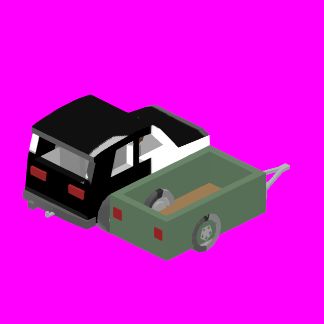
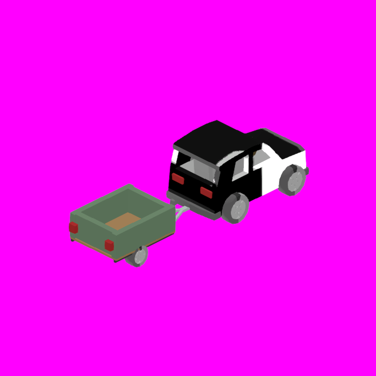

# Car trailer — measured against this repository

## Measurements first

Based on `1f7f106d`, branch `astra-cartrailer`. I reread [vehicle_measurements.md](vehicle_measurements.md), retained its fleet dimension tables rather than regenerating them, and added [car_trailer_measurements.md](car_trailer_measurements.md). That supplement contains **all 21 existing road rear ends**, including the semi trailer, with body/Parts rear Z, the centreline rear surface's Y interval, candidate mounting Y, nominal ground coordinate, tracks and effective wheel radii.

| Reference | Number taken from the repository | Use |
| --- | --- | --- |
| Golf body, saved fleet table / `golf_body.txt` | 5.228553 long × 2.522099 wide | Half-length deck; half-width contributes to tongue clearance |
| Golf / hatchback / sedan / SUV / jeep / offroader / truck / van wheel anchors | X ±1.300000; track 2.600000 | Trailer wheel centres follow their tracks |
| Ordinary car radii / rear mount Y | Radius 0.600000; wheel anchor Y 0.250000 | Nominal rear ground is −0.600000 with 0.250000 suspension rest drop |
| `quad_wheel.txt` / `_quad` | Radius 0.450000, width 0.400004; mass 300 kg; health 450 | Native smaller wheels, body mass and health |
| Golf rear centreline surface | Z 2.483066, Y −0.158646..0.100804 | Hitch mounting Y is the midpoint, −0.028921 |
| Golf complete original rear | Z 2.559203 | Hitch Z = 2.559203 + 0.150000 = 2.709203; it clears even the off-centre rear extremity |
| Current SUV | Body rear Z 2.680000; separate bumper Z 2.826938 | The old wagon row's 3.192378 rear is obsolete; use the separate bumper |
| `trailer_0.txt` / full `_trailer` spec | 3.000000 × 2.499998 × 16.100001; 268 v / 111 tris; mass 6000; Kingpin (0,.62,−6.6); BoxSize (3,1.10,12.35); `jeep_wheel.txt` | Existing coupling/landing-gear/passive-wheel pattern; no semi-scale geometry copied |

The radius premise needed correcting: **quad uses 0.450**, semi and semi trailer effectively use **0.650** through `WheelRadii` overrides, APC/tank use **0.740**, and tractor uses **0.900/1.050**. Ordinary cars use 0.600. Boats' unused 0.300 values are not smaller road wheels. The fresh wheel mesh is the quad's actual native asset, without a mismatched radius-only shrink.

Coordinate confirmation comes from the real Golf: headlights occupy Z −2.565942..−2.440543, taillights +2.224357..+2.349755. Body coordinates are **X lateral, +Y up, −Z forward**, unchanged by ParseObj. No gun-frame transform is used.

All “above ground” heights below mean **nominal uncompressed/rest suspension geometry**: ground = rear wheel anchor Y − effective radius − rest length. Loaded springs, road pitch and terrain were not measured. The table does not invent an observed driving ride height.

## Dimensions and their derivations

The fractions below are explicit design choices applied to measured donors, not claims that the fleet already contains a car trailer. Let `R = 0.600` (car), `r = 0.450` (quad), and `t = (R−r)/3 = 0.050000 m` (the construction module). Generated coordinates are rounded to six decimals; half the Golf's length is 2.6142765 before rounding. The saved deck endpoints give 2.614276 m; the difference is sub-micrometre rounding.

| Feature | Authored value | Traceable rule |
| --- | --- | --- |
| Deck outer length | 2.614276 m saved | Golf body length / 2; under half the sedan and far below the semi's 16.100001 |
| Deck outer width | 2.099996 m | Car track − native quad tyre width − 2t = 2.6 − .400004 − .1 |
| Deck Z range | −1.307138..+1.307138 | Centred half-Golf deck |
| Deck finished local Y / nominal height | .250000 / .850000 m | Golf wheel mount Y; add the common .600000 origin-to-ground distance |
| Deck total thickness | .087500 m | 2t less t/4, so the slab's top sits under the sideboards' base rather than exactly on it |
| Timber floor | One slab, full deck width | Matches the truck's own bed, whose floor is a single 1.616 m2 quad in two triangles with no board lines. Nine modelled boards cost 72 tris to say what a flat surface and a palette colour already say |
| Sideboards | .450000 total height above deck; top Y .700000 | Quad radius r, reached by the board itself. The separate capping rail and the six stake posts are gone: 96 tris of trim at a scale nothing else in the fleet models |
| End boards / tailgate | Width 1.999996, thickness .050000; inset .010000 from deck ends | Deck width − 2t; t; t/5. Fixed in gameplay; the hinge blocks and latches that used to stand proud of the deck are removed, so the rear datum is now the deck at L/2 |
| Wheel centres | (±1.300000,.100000,.261428) | Car half-track; Y adjusted by r−R from car mount Y; axle at 60% of deck length from its front (Z = length/10) |
| Wheel centre at rest | Local Y −.150000 | Mount Y − .250000 rest drop; bottom = −.600000, matching cars |
| Physical tyre lateral envelope | X ±1.500002 | Car half-track + quad tyre half-width; car tyres reach ±1.500003 |
| Mudguard lateral envelope | X ±1.550002; each .500004 wide | Native tyre width + 2t clearance. The tyres stay in car tracks; guards add .050000 per side beyond the tyres |
| Mudguard crown | Inner .750000 / outer .800000 radial envelope about rest wheel centre | r + full .250000 rest compression + t clearance; add t sheet thickness; six half-circle facets |
| Fender compression clearance | At least .013279 m under the conservative enclosing circle | Segment count is DERIVED: the smallest n whose facets clear, at the standoff the fleet already uses. Five here. Coarsening to three pulls the facet midpoints 5 cm INSIDE the envelope even though no vertex moves, and buying that back by inflating the radius (.750 to .858) turned the fender into three plates tented over the wheel |
| Axle beam | .100000 × .100000, across 2.600000 track | 2t cross-section; beam centred on wheel rest Y and measured-design axle Z |
| Chassis beams | .100000 × .100000 along deck | 2t sections; X centres ±(deck half-width−2t), Y .100 = deck Y−3t |
| Free tongue: pin to deck front | 1.711050 m | Golf half-body width + quad radius = 1.2610495+.450 |
| Two inclined A-frame beams | .100000 square | 2t; start X ±t at pin Z+4t, end X ±(deck half-width−2t) at deck front+length/4; rise from pin Y to deck Y−3t |
| Kingpin (ball/socket pivot) | (0,−.028921,−3.018188) | Golf bumper Y midpoint; deck front − free tongue |
| Socket body | .200000 wide × .100000 high × .300000 long | 4t × 2t × 6t; Z pin−2t..pin+4t; latch/handle sections t and t/2 |
| Car receiver and octagonal ball | .100000 receiver section, .050000 ball radius | 2t / t; receiver starts t inside each measured rear centreline section and ends t beyond its own tow point |
| Parking stand | Foot .200000 square, .050000 thick; support top Y −.078921 | 4t foot, t thickness; bottom at common nominal ground −.600000; top at pin Y−t; X=3t, Z midway between pin and deck front |
| Support collider | (.200000,.521079,.200000) at (.150000,−.339460,−2.162663) | Exact bounding box of shaft + foot; matching mesh split zone retracts on coupling |
| Mudflaps | Native guard width; .025000 thick; Y −.375000..−.050000 | t/2 thickness; rest wheel centre−r/2 through centre+2t |
| Hinges / latches / reflectors / lamps | Multiples of t | Hinges 4t × t × t at ±.65 deck half-width; latches t × 2t × t/2; amber reflectors 2t × 2t × t/2; tail lenses 4t × 2t × t at X ±(deck half-width−3t) |
| Full saved body AABB | (−1.550002,−.600000,−3.118188)..(1.550002,.700000,1.357138) | Guards set X; support foot and rail set Y; pin−2t and deck rear+t set Z |
| Full body X × Y × Z | **3.100004 × 1.300000 × 4.475326 m** | Difference of those saved extrema; includes hardware/parked stand, excludes separate wheels |
| Empty mass / health | 300 kg / 450 | Quad spec; 1/20 the semi trailer's mass, 27.3% of the 1100 kg hatchback. Design tuning, not a payload/tow rating |

The mesh is an open green-sided utility trailer with a timber deck, single axle, A-frame drawbar, coupler/locking handle, faceted mudguards, mudflaps, rear lamps, hinges and latches. It is not a trailer for carrying a whole car.

The body is an assembly of closed solid components, with ordinary overlapping structural joints. It is not a Boolean-unioned single skin. It has **80 position records, 120 triangles, zero boundary edges, zero non-manifold geometric edges and consistent opposite edge winding**. Rear lights are 16 v / 24 tris. Each of the eight hitch meshes is 24 v / 40 tris. All authored files have explicit per-corner UVs/normals and exactly three corners per face. No zero-area triangles or out-of-range indices; smallest body triangle area approximately .000625 m².

All 11 authored mesh/palette assets were also regenerated and compared byte for byte; there was no drift.

Main collider BoxSize is (2.099996,.100000,2.614276), centre (0,.200000,0). HullBoxes retain the deck and two yaw-aligned drawbar beams; beam Y conservatively encloses their rise. ExtraBoxes cover side/end walls and the socket, leaving the load space open. The thin end panels are inset .010 m relative to their conservative collider planes. Mudguards, small hardware and car receiver Parts are visual geometry rather than individually fitted collision shapes.

## Coupling decisions

Enable **golf, hatchback, sedan, wagon/SUV, jeep, offroader, truck and van**. All share the confirmed 2.600 track, .600 tyres and −.600 nominal rear ground datum; their bumper sections give effectively the same ball height, so the trailer can sit level. The SUV's independently measured bumper is .000354 m lower; that tiny nominal offset is explicit.

Retain the semi's existing fifth wheel. Leave quad (1.000 track), tractor (1.806/3.010 tracks and differing axle datums), bus (3.000 track), APC/tank (4.000/4.522 tracks and high rear sections), military and emergency vehicles, and roadster unchanged. Track/height rule out several cleanly. Humvee, police, ambulance and roadster share suitable geometry: excluding those is a scope/vehicle-role choice, **not** evidence of a measured inability to tow. There are no manufacturer tow ratings in these meshes. Ordinary hatchback/sedan/SUV and utility vehicles are the enabled set.

Every point is **(0, its own rear-section Y midpoint, its own original Body+Parts rear Z + quad radius/3)**:

| Tow car | FifthWheel local XYZ | Nominal height |
| --- | --- | --- |
| Golf | (0,−.028921,2.709203) | .571079 |
| Hatchback | (0,−.028921,2.943911) | .571079 |
| Sedan | (0,−.028921,3.092378) | .571079 |
| SUV (`wagon`) | (0,−.029275,2.976938) | .570725 |
| Jeep | (0,−.028921,2.743243) | .571079 |
| Offroader | (0,−.028921,2.743243) | .571079 |
| Truck | (0,−.028921,2.743243) | .571079 |
| Van | (0,−.028921,2.743243) | .571079 |

Identical values on the jeep-derived bodies reflect identical measured geometry. No common Z was applied across the fleet. Each car has its own generated receiver/ball Part, registered on both existing rendering paths. The coupler nose sits .050000 m behind the complete towing-body rear plane when aligned; the pivot itself is .150000 beyond it.

The existing `Kingpin` mechanism supplies `IsTrailer`, passive wheels, zero powered-wheel traction, the cab-owned PinJoint3D, attach translation to coincident pins, ghosting, support retraction and tail/brake-light pass-through. Engine, steering, speeds and brakes are zero; the semi's inert gears and positive nominal Fuel=1000 avoid null/division problems. Trailer entry remains blocked by existing `IsTrailer` handling; no passenger seats were invented.

One small system extension is necessary for this shape: `Spec.HitchYawLimit`, default zero meaning the existing 90° limit. The car trailer supplies **57.860160° = atan2(free tongue length, outer front-rail half-width)**. The runtime clamp uses the trailer's limit. At that angle the rail's closest corner remains behind the pin; a sweep of all body vertices over the full ±limit keeps them beyond every towing car's original rear plane. The socket's diagonal corners retain at least approximately .0086 m of that conservative clearance. This is a geometric yaw guarantee for level bodies, not a pitch/roll/dynamic-contact guarantee. The semi retains 90°.

## Registration and verification

Spawn with the canonical vehicle name **`car_trailer`** wherever the existing vehicle command accepts `golf` or `wagon`. Added `BuildCarTrailer`, `BuildByName`, `SpecFor` (including the MP puppet path), and an **append at SpecNames TypeId 33**. Every old key and index from `1f7f106d` remains unchanged, including SUV at 32. It is command-only; the natural spawn pool is unchanged. The wagon verifier was updated to allow later appended vehicles while still comparing its entire original index prefix.

- `dotnet build game/UnturnedGodot.csproj`: passed. Both the final build and a control build with the original `1f7f106d` Vehicle.cs (new test omitted) reported **22 identical pre-existing warnings, zero errors**. Warning messages were compared as sets; there are no new warnings.
- `python3 tools/verify_car_trailer.py --mutation-test`: **53 named checks, 209 deliberately failing real-file regressions**. I actually reverted/corrupted each checked behavior (including all eight own-rear tow points, mesh corner/index/normal/UV/topology failures, palette V compensation, registrations, TypeId insertion, radius/track/axle, support, and yaw spec/transfer/clamp). Each failed the corresponding check. The verifier restores exact original bytes in `finally`, then reruns the unmodified checks. No check is presented without an exercised failing mutation.
- `python3 tools/verify_wagon.py`: passed, retaining the original 32 pre-wagon TypeIds and wagon TypeId 32.
- Godot 4.6 `--headless --path game -- --tests=vehicle.car_trailer`: **46 checks passed** in the construction/coupling fixture: actual server/replica mesh loading, canonical identity, two passive wheels, all eight hitch Parts, attach/detach and PinJoint presence, coincident anchors, retracted/redeployed support, and imported yaw limit. Headless was used for this fixture only, not for the renders.

The static verifier reads saved meshes under ParseObj's float32, three-corner and V-flip rules. Expected dimensions come from donor files/specs independently of the geometry generator. It checks relationships, not just a second list of the authored dimensions.

## Render evidence

I rendered and inspected all three images through Godot 4.6 Vulkan/llvmpipe under Xvfb, **without `--headless`**, with `UG_ISO=1`. [Beside the Golf](car_trailer_beside_golf.png) and [coupled to the Golf](car_trailer_coupled_golf.png) are each a **single combined OBJ** containing the original, unscaled car body and both vehicles' actual wheel meshes. Only translation, left-wheel reflection and atlas UV remapping are applied. The coupled image translates the trailer by Golf FifthWheel minus trailer Kingpin and hides its stand. These are static poses, not driving screenshots. The direct bake uses an opaque atlas, so the Golf's paint/glass appearance is not a gameplay material test.





[Standalone detail render](car_trailer_alone.png). Its automatically fitted camera is useful for examining geometry; it is not scale evidence on its own.

Reproduce the generated meshes and render inputs with:

```sh
python3 tools/build_car_trailer.py
python3 tools/preview_car_trailer.py
UG_ISO=1 xvfb-run -a /home/ec2-user/godot46/Godot_v4.6-stable_mono_linux_arm64/Godot_v4.6-stable_mono_linux.arm64 \
  --path game --rendering-driver vulkan --render-thread safe -- \
  --bakeicon=car_trailer_preview_beside.txt:car_trailer_preview_atlas.png \
  --shot=/tmp/car_trailer_beside.png
```

Substitute `alone` or `coupled` for the other inputs. The `--` separator is required because Main reads `OS.GetCmdlineUserArgs()`. Render inputs are generated scratch files; the PNG evidence is committed. The first beside render saved successfully but emitted a renderer-thread shutdown error; subsequent renders used the supported `--render-thread safe` option.

## What I could not verify

**No sustained driving test was performed.** Snaking, loaded suspension heights, braking/reversing behavior, hill starts, pitch/roll articulation and long-run stability are unverified. The positive axle offset is a deliberate nose-load bias, not proof that the trailer tows well. No payload capacity or real-world tow rating is claimed. Cargo retention is untested; there is no animated/opening tailgate or new cargo system.

Server and puppet construction were exercised, but actual network spawning, multiplayer hitch interaction and replication of the coupled relationship were not. The existing system does not distinguish ball hitches from semi fifth wheels, so it still permits geometrically incompatible car/semi pairings if brought within coupling reach. I did not add a hitch-class protocol or change that existing behavior.

The geometry sweep is level/static; the existing pair ghosting and anti-clip behavior under real contact remains unverified. The attachment test exercises construction and lifecycle, not a car driving with a trailer. No result above should be read as a successful road test.

## Detail pass (strawberry: "redo. too much detail. look at the truck bed etc")

The first body was **572 triangles** -- 5th busiest of the fleet's 31 bodies, above every car, above
the truck's whole 390 and the van's 422, for an object that is a flat deck on one axle. The reference
named in the note settles what the fleet's vocabulary actually is: the truck's bed floor is **two
triangles**, one 1.616 m2 quad at Y=0.125, with no board lines anywhere.

Removed, with what each cost: nine modelled deck boards (72), six stake posts (72), two capping rails
(24), two gate rails (24), tailgate hinges (24) and latches (24), mudflaps (24), amber reflectors (24),
the coupler's latch (12) and handle (12), the landing foot pad (12), and six fender segments cut to
five (16). Everything on that list is a box under about 8 cm, which is below the scale anything else in
the fleet models -- they read as noise on the silhouette rather than as detail.

**572 -> 232 triangles, 366 -> 144 vertices.** That lands between the wagon (226) and the jeep (232),
in the fleet's lower third, which is where a trailer belongs.

Two things this pass changed that are not just deletions. The deck is one slab whose top sits t/4 under
the sideboards' base: coplanar faces with coincident corners get welded by `save(weld_positions=True)`
and the shared edge then carries four faces, which the verifier correctly calls non-manifold. And the
fender's segment count is now derived rather than chosen -- see the clearance row above for why three
segments is wrong at this radius and why inflating the radius to rescue it is worse.

## Second pass: arches out, truck-bed wall section, sedan lamps, bigger

strawberry: *"remove the wheel arches. the truck bed walls/body measure the thickness and size. the tail
lights should be off the sedan. should also be bigger"*.

**The truck bed's wall section, measured.** Isolating the bed (Z > .294, behind the cab) and selecting
its side walls by face normal gives outer/inner planes at |X| 1.231 / .981 and a wall running from the
floor plane at Y .125 to Y 1.125. So **.250 thick, 1.000 tall, 2.462 outer width**. Mine were t = .050
and .450 -- five times too thin and under half the height, which is what made the box read as a tray
rather than as bodywork. Both numbers now come from `truck_bed()` and neither is typed.

`expected()` re-derives the same section by a **different route** (a Z slab plus vertex-column
clustering, anchored on the bed's own floor plane) precisely so a bug in one shows up as a
disagreement. It earned that twice while being written: clustering without excluding the cab's rear
wall reported the wall as 2.250 tall, and anchoring the floor on the wall column's lowest vertex
reported 1.250. **Both are real numbers answering a different question** -- the second is the wall
panel including the .250 of under-frame below the deck, which is not a height you can stand a crate
in. They agree to 3.3e-07 m now.

**Arches removed**, and with them the derived segment-count machinery from the previous pass. The
wheels tuck flush under the deck edge instead: track is `deck_w - tyre_width` = 2.062, so the tyres end
exactly at |X| 1.231. Leaving them on the Golf's 2.600 track would have hung them 270 mm outboard of a
deck with nothing above them. The clearance check went with the part, replaced by its negative: an
assertion that nothing arch-shaped exists in either the mesh or the generator.

**Tail lamps are the sedan's mesh**, not a pair of boxes shaped like it -- 56 v / 20 tris, its exact
2.2269 x .3291 x .1899 section, translated so the front face meets the trailer's rear and the lenses
centre on the tailgate. X is untouched, which is the point: at +/-1.1135 they already sit inside a
2.462 deck. The palette's red is now the sedan's own measured (142,32,32) texel. A verifier check pins
this as a **rigid translation** -- one distinct offset across every vertex, dX = 0 -- which a lookalike
box of the same bounds would fail.

Note `sedan_taillights.txt` is itself **two open shells** (8 unpaired edges in the fleet's own asset),
so the closure requirement is waived for that one mesh and replaced by the translation check above.
Everything else -- ParseObj rules, indices, per-corner normals and UVs, degenerate and duplicate faces
-- still applies to it.

**Bigger:** deck **3.1371 x 2.4620** (was 2.6143 x 2.1000), from `golf length * .6` and the truck bed's
own outer width. Body is **96 v / 144 tris**, down again from 232.

## Third pass: one section throughout, wheels proud, lens flush

strawberry: *"fix the weird geom. make edges consistent. move wheels to the sides like cars are. move
tail lights so they stick out the same as sedan"*.

**One section for the whole cargo box.** Deck, both sideboards and both gates are all `wall_t` = the
truck bed's .250; nothing in the box is a different thickness now. The separate chassis rails are gone
with the mixture -- they were t = .050 members under a .0875 deck, and a .250 slab **is** the
under-frame, which is exactly how the truck carries its own bed (floor at Y .125 over structure down to
-.125, precisely .250).

**The weird geometry was a lip.** The deck used to overhang the tailgate by `wall_t`/4 and the
headboard by the same, so the trailer ended in a thin shelf standing proud of the panel that was
supposed to be its back. The gates own the ends now -- their outer faces are the deck's front and rear
planes -- and the deck is inset half a section inside all four walls, which also removes a coplanar
pair on |X| = w that would have z-fought.

**Wheels sit proud, like every car's.** Measured across the fleet: sedan, hatchback, golf, police,
jeep, offroader, truck and van all share body half-width 1.261 against track/2 1.300 and tyre
half-width .200 -- **the tyre's outer face stands .239 outboard of the bodywork on every one of them**.
Tucking the wheels under the deck was my own idea when the arches came off, and it made the trailer
read as a box on castors. Track is back to the fleet's 2.600.

**The lens is nearly flush, not hanging off the back.** Both obvious readings are wrong. Against the
sedan's rear-most point (2.9424) the lens is **154 mm recessed** -- but that point is the bumper, down
at Y -.27..1.00. And there is no body vertex inside the lens's own Y band at all, so sampling by height
finds nothing to compare against. What the sedan actually has is a stack of tail planes -- 2.7265,
2.7562, 2.7644, 2.7993, 2.8662, 2.9424 -- with the lens rear at 2.7880 sitting *between* two of them:
**24 mm proud of the one behind it, 11 mm inside the one in front**. So the honest relationship is
"flush to within a couple of centimetres". The trailer's lens now stands .0236 proud of the tailgate,
derived from that nearest plane. It previously stood its full 190 mm depth out in the air, six times
the sedan's relationship, because I had seated its *front* face on the rear plane.

Body is **80 v / 120 tris**, down from 144.

## Fourth pass: the car's wheel, and what that forces

strawberry: *"scale the wheels to be the same size as the car's"*.

The trailer ran the quad's `quad_wheel.txt` at WheelRadius .450. Every road vehicle in the fleet runs
`jeep_wheel.txt` at **.600**, so that is what it runs now, with the matching `jeep_wheel_albedo.png`.

**Two derivations had to move out of the way first**, because both were defined in terms of the wheel
and would have changed things nobody asked to change:

- `t` was `(car_radius - quad_radius)/3`. With the trailer on the car's wheel that is **zero**. Same
  .050 value now comes off `wall_t/5` -- the section that is actually load-bearing in this model.
- `hitch_projection` was `radius/3`. Left alone it would have dragged **all eight cars' tow balls**
  50 mm further back as a side effect of scaling the trailer's tyre. Pinned to `3*t`, same .150.

**And the wheel scale exposed a defect I had shipped last pass.** Putting the wheels back on the fleet
track without arches left the tyre *buried in the sideboard*: inner face at 1.100 against a sideboard
outer face at 1.231, so **131 mm of X through 550 mm of Y of tyre inside the bodywork**. It was there
at .450 and it gets worse at .600. The fleet's cars live with that overlap because they have ARCHES cut
into the body, and those are gone by instruction.

So the deck's outer width is **2.100**, not the truck bed's 2.462: `track - tyre_width - 2t`, clearing
each tyre by t. The truck still governs the wall **section** (.250 thick, 1.000 tall), which is what
"the truck bed walls/body measure the thickness and size" actually asks for; its overall width is not
available to a trailer that has no arches and car-sized wheels. Deck is 3.137 x 2.100; body 80 v / 120 tris.

**The render was lying, and that is worth recording.** `preview_car_trailer.py` staged the trailer's
wheels from the literal `'quad_wheel.txt'` rather than from the spec, so the first re-bake after the
change came back showing the old .450 wheel and looked exactly like a change that had not landed. It
reads `d['wheel_mesh']` now. Verified by measuring the staged mesh rather than by eye: the vertices at
the trailer's axle span 1.1826 in Y, which is the jeep wheel's height, not the quad's .8869.

## Fifth pass: ride height and lamp spacing, both off fleet constants

strawberry: *"move the wheels higher up on the trailer. bring the tail lights closer together"*.

**Ride.** Measured across golf, sedan, hatchback, jeep, truck and van: every one rests its wheel centre
**.2734 above the body's lowest point**, without exception. The trailer's sat at **.0000** -- centre
exactly level with the deck's underside, which is what made it read as a box on stilts. Raising the
wheel and lowering the body are the same edit and the body is the half that can move, since the tyres
have to keep meeting the ground: `deck_y` is `wall_t - ride` = -0.0234, down from .2500.

**Lamp spacing, and it was a defect rather than a preference.** The sedan insets its lenses **.1476**
from its body side. Transplanted unchanged onto a 2.100 deck they reached |X| 1.1135 against a 1.050
side -- **hanging 63.5 mm out past the trailer**. They now sit at the sedan's own inset, |X| 0.9024.

Two details that only showed up on measurement. The sedan's lens pair is **not symmetric** -- max |X|
is 1.113476 on the left and 1.113453 on the right, 23 um apart -- so one shared offset lands the two
lenses at different insets; each side is solved to the same target instead. And the verifier now pins
the **outcome** (both lenses inset by the sedan's figure, each lens rigid within itself) rather than
requiring the two shifts to be exactly mirrored, which that asymmetry makes impossible.

**Both new checks were toothless on the first try**, and the mutation audit caught both surviving: each
compared numbers `expected()` had derived itself, so no file mutation could fail them. They read the
mesh and the spec now -- the deck group's underside against the spec's wheel anchor, and the lamp
vertices against the sedan's.

## Sixth pass: decently longer, slightly wider (astra-trailer-big)

**Width decision: route 1, widen the track with the box**, relative to `main` at `5297da9d`.
The saved sideboards now end at
**|X| 1.112497**, and the actual `Vehicle.cs` wheel anchors are **±1.362500**. The specified
`jeep_wheel.txt` measures **.400006 wide**, so its inner faces are at **|X| 1.162497**: the original
**.050000 m clearance per side is preserved**. The clearance assertion and its `t−1e-6` threshold
are unchanged. Returning these wheels to the Golf's track puts **12.5 mm of tyre inside the wider
sideboard**; that exact regression is now an additional failing mutation.

“Slightly” means **half the truck's measured .250 wall thickness added to the total width**:
**+.125 m / +5.95%** over the previous 2.099994 box. Each wall and wheel moves out **.0625 m**;
the track becomes **2.725 m**, from the Golf's 2.600. Including the real wheel mesh, the trailer is
**3.125006 m wide**, versus the Golf's **3.000006 m**: **4.17% wider overall**, just .0625 m beyond
the Golf's tyre envelope on each side. Fresh Golf measurements are body **5.228553 long × 2.522099
wide**, with no Body/Parts vertex farther out than |X| 1.261051; the wheels determine its total width.
That is a modest increase next to its tow car, while keeping the low bed and exposed car-sized wheels.

Rejected widths: one whole truck wall section extra would make a **2.349994 m box / 3.250006 m
total**, an **11.90% box-width increase**; using the truck's full **2.462 m** box width would require
**2.962006 track / 3.362012 total**, **12.07% wider overall than the Golf**. Both go farther than
“slightly.” Keeping the original 2.600 track with the chosen wider box fails the clearance measurement
above. Route 2, restoring arches, contradicts the author's explicit removal instruction.

Route 3, putting the entire box above the tyres, is measurable and too high here. The wheel mesh
spans Y **−.600000..+.582565** at the staged rotation and has a swept Y/Z radius **.600001**. With
the wheel rest centre at local Y 0, nominal ground at −.600, the same .050 gap and a .250 floor
section require a finished bed height of **1.500001 m above nominal ground even at rest**. Allowing
the existing .250 rest drop to compress to the anchor requires **1.750001 m**. Those are increases
of **.923432 / 1.173432 m** over the current .576569 bed. These are conservative clearance heights
for a flat box entirely above the rotating wheel, not observed suspension or driving results.

The new dimensions follow the existing measured donors. Fractions are design choices; dimensions
are metres. The outer deck footprint includes its surrounding walls, as in the previous passes.

| Feature | New value | Derivation |
| --- | --- | --- |
| Outer deck length | **3.921415** in spec; **3.921414** between saved end faces | **3/4 × Golf body length 5.228553**, from 3/5 previously: **+.784283 / +25%**; sub-micrometre endpoint rounding |
| Outer deck width | **2.224994** | Golf track 2.600 + half truck wall section .125 − real tyre width .400006 − 2t .100 |
| Wall / gate / floor section; wall height | **.250000; 1.000001** | Truck bed outer/inner X planes and floor-to-wall-top measurement; `t = wall_t/5 = .050000` |
| Clear opening between walls | **3.421414 long × 1.724994 wide** | Saved outer length/width less two truck wall sections |
| Floor slab | **3.671414 long × 1.974994 wide × .250000 thick** | Outer footprint inset half a wall section at each edge, preserving overlapping joints |
| Finished deck Y / nominal height | **−.023431 / .576569** | Truck wall thickness minus Golf wheel-rest-centre-to-body-underside distance .273431; ground −.600 |
| Sideboard top local Y | **.976570** | Deck Y + measured truck wall height |
| Wheels / track / anchors | **jeep_wheel.txt, r .600000; 2.725000; (±1.362500,.250000,.392141)** | Golf wheel and anchor Y; Golf track + wall_t/2; axle stays 60% of outer deck length from its front (`Z = L/10`) |
| Axle beam | **2.725000 × .100000 × .100000** | New track × 2t × 2t, at wheel rest Y 0 and axle Z |
| Tyre outer envelope / sideboard gap | **±1.562503 / .050000** | Saved spec anchors ± actual wheel half-width; compare against saved sideboard faces ±1.112497 |
| Free tongue, pin to front wall | **1.861050** | Golf body half-width 1.2610495 + Golf radius .600 |
| Kingpin | **(0,−.028921,−3.821757)** | Golf rear-section Y midpoint; `Z = −L/2 − free tongue` |
| Drawbar beam section / plan length | **.100000 square / 2.811301** | 2t; endpoints at `(±t, pinY, pinZ+4t)` and `(±(W/2−2t), deckY−wall_t/2, −L/4)` |
| Drawbar collider height / yaw | **.219510 / ±20.021160°** | Absolute Y difference of those mesh endpoints + 2t; `atan2(dx,dz)` in plan |
| Main box size / centre | **(2.224994,.250000,3.921415) / (0,−.148431,0)** | Outer footprint × truck floor section, centred half a section below deck Y |
| Hitch yaw limit | **58.566199°**, formerly 59.988005° | `atan2(free tongue, W/2+t/2)`; complete saved-body sweep still clears the towing rear plane |
| Stand Z / split-zone Z | **−2.891232 / −2.991232..−2.791232** | Midpoint of pin and front wall, with ±2t split clearance; existing support height remains .521079 |
| Lamp outside | **|X| .964902; rear Z 1.984333** | Each original sedan lens rigidly translated to the sedan's .147595 side inset and .023626 tail-panel projection |
| Saved body AABB | **(−1.362500,−.600000,−3.921757)..(1.362500,.976570,1.960707)** | Axle ends, parked stand bottom, pin−2t coupler nose, wall top, tailgate rear |
| Complete static trailer envelope | **3.125006 wide × 1.576570 high × 5.906090 long** | Body + actual wheels + sedan lamps; lamps extend the body's 5.882464 length |
| Empty mass / health | **300 / 450** | Existing quad spec donors; no new payload or tow rating |

While following the enlarged drawbars into their colliders, I found an existing defect from the
lowered ride height: the generator still used `deckY−3t` for the collider endpoint and a signed rise,
emitting **negative .044510 m collider heights**. Both mesh and collider now use the same endpoint
at the floor section's midpoint; collider height encloses the **absolute** rise. A new check transforms
the saved beam vertices into each actual spec collider's frame and compares their bounds. Another
checks the saved wall/socket geometry against all five `ExtraBoxes`, including the new length and
width. Their mutations restore old dimensions, move real geometry or colliders, and remove yaw.
The old collider dimensions are read from `5297da9d`, rather than copied into the verifier.
The main collider check measures the saved floor and outer walls; the wall-section check compares
the saved trailer against the truck mesh; the landing collider must coincide with its split zone.
Array mutations replace whole initializers, so wheel and lamp regressions retain valid C# syntax.

The body remains **80 vertices / 120 triangles**, with explicit normals/UVs, triangle-only faces,
closed components and overlapping joints. Sedan lamps remain **56 vertices / 20 triangles** with
their original per-lens geometry. All eight car hitch assets and tow points, wheel radius, ride
height, wall section, lamp inset, and `car_trailer` **TypeId 33** remain unchanged.

Validation for this pass:

- `python3 tools/verify_car_trailer.py --mutation-test`: **55 named checks, 225 rejected real-file
  mutations**. All original 53 checks and 209 mutations remain represented; the track check now
  requires the measured increase. Both original tyre-clearance mutations still fail, as do the new
  opposite-side and restored-Golf-track mutations. Every check has a live mutation; none survived or
  was ineffective. Each rejection is printed. Original bytes were restored and clean checks rerun.
- `dotnet build game/UnturnedGodot.csproj`: **succeeded, zero errors, 22 warnings** (the warning count
  already documented above). `./test.sh` and the gameplay test fixtures were not run.
- A second generator run reproduced **all 11 mesh/palette assets and the spliced C# spec byte for
  byte**. Saved preview wheel vertices also match the actual spec anchors and wheel mesh within
  **one micrometre** in all three staged poses.
- Re-rendered the three previews with Godot 4.6 Vulkan/llvmpipe, `UG_ISO=1`, Xvfb and
  `--render-thread safe`, without `--headless`; all are 640 × 640 and were visually inspected. The
  longer box keeps the low bed and simple silhouette. The comparison meshes retain the original
  unscaled Golf; its opaque atlas paint/glass appearance is still not a gameplay material check.
  The coupled view aligns the pins and hides the stand. All three renders exited without errors.

[Standalone](car_trailer_alone.png), [beside the Golf](car_trailer_beside_golf.png),
[coupled to the Golf](car_trailer_coupled_golf.png).

**Towing stability, cargo retention and multiplayer hitch behaviour remain untested.** These static
geometry/spec checks and bakeicon poses do not establish loaded ride height, braking or reversing,
pitch/roll contact, sustained towing stability, or network coupling/replication. The wider track and
longer box are measured geometry changes; the previews are not driving evidence.

## Sixth pass: no axle, wheels against the walls

strawberry, on the render: *"fix the floor? looks inconsistent"*, then *"its the axle. remove the axle
and have the wheels flush with the trailer walls"*.

The floor itself measured fine — the deck reaches |X| .987 against sideboard inner faces at .862, so it
covers the interior completely; the narrow visible strip is a 1.000-deep box occluding its own floor at
isometric elevation. What was inconsistent was the **axle bar** reaching out under the deck to wheels
standing .050 clear of it. Both are gone: no axle group, and the track is solved from the box instead
of the box from the track.

**"Flush" has two readings and only one of them is buildable.** Aligning the tyre's OUTER face with the
wall — track 1.825 — puts the wheel **through the cargo bay**: the tyre tops out at Y .600
against a deck floor at -0.023, so its inner half rises into the box. Rendered it to be sure, and it is
as bad as it sounds. The only arrangement with a wheel inboard of the wall raises the bed over it,
which needs `deck_y` **1.100** against today's -0.023 — a lorry-height floor on a car trailer.

So flush means **against**: the tyre's inner face sits exactly on the sideboard's outer face, track
2.625, gap closed to zero. That gap is what the axle bar was spanning, which is why removing the bar
and closing the gap are one change rather than two.

Body is **72 v / 108 tris**, down from 120 with the axle gone. The clearance check is not deleted — it now
asserts the flush relationship instead, off the real mesh and the real spec, and its docstring records
that the old gap rule is dead **by instruction** so nobody re-derives it.

## Seventh pass: a family of three (superseded by the eighth)

strawberry: *"apply the axe and wheel change to the dinky trailer. thats its name. dinky trailer. the
new one is small trailer. do a medium one which is longer and wider. and 4 wheels."*

One derivation, three size classes. `CLASSES` in `measure_car_trailer.py` carries only the two things
that make a size — a fraction of the Golf's body length, and a count of HALF TRUCK WALL SECTIONS added
to the Golf track before the box is solved out of it — so every dimension still traces to the same two
fleet measurements a single trailer did. Nothing is a typed dimension.

| class | key | deck | track | axles | body |
|---|---|---|---|---|---|
| dinky | `dinky_trailer` | 3.137 x 2.100 | 2.500 | 1 | 72 v / 108 tris |
| small | `small_trailer` | 3.921 x 2.225 | 2.625 | 1 | 72 v / 108 tris |
| medium | `medium_trailer` | 4.967 x 2.350 | 2.750 | 2 | 72 v / 108 tris |

**The dinky is the vehicle already in the game**, re-derived at its original 3.137 x 2.100 and given
the axle removal and flush wheels along with the rest. **The medium runs a tandem**, and its axle
spacing is derived rather than chosen: two tyres of radius r on one side cannot intersect in Z, so
their centres sit at least 2r apart, plus t of clearance -- 1.250 here. Both axles straddle the same
60%-of-deck point the single-axle classes put their one axle on.

**Naming.** `car_trailer` was the shipped spawn name and stays as an **alias** onto the dinky, so the
command people already have keeps working. It is deliberately NOT in `SpecNames` -- that array's
indices are replicated network TypeIds and an alias there would consume one. The rename happened **in
place at index 33**, so every TypeId before it is untouched and the two new sizes are appended at 34
and 35. A named check asserts exactly that ordering, with mutations for an insert, a swap and a drop.

**The verifier runs three times.** `KEY`/`BODY`/`LAMPS` are rebound per class and `main()` loops, so
every check written for one size is a check on all three: **168 named checks, 687 mutations**, all
caught. Four mutations had to be repaired to get there, and all four failed the same way -- they
matched a literal that was only true for one class, or used `replace(..., 1)` which lands on the first
of three spec blocks rather than the one under test. An unmatched mutation is reported as *ineffective*
rather than passing, which is the only reason they were visible at all.

Renders: `car_trailer_family.png` puts all three beside the Golf on one ground plane at true scale.
Unverified as ever: towing stability, cargo retention, multiplayer hitch behaviour.

## Eighth pass: a large class, and the width limit lifted (see the correction below)

strawberry: *"now do a large one. twin axle. wider! ignore the limit on width. redo the medium with no
width limit"*.

| class | key | deck | track | axles | floor | wheels |
|---|---|---|---|---|---|---|
| dinky | `dinky_trailer` | 3.137 x 2.100 | 2.500 | 1 | -0.023 | beside the box |
| small | `small_trailer` | 3.921 x 2.225 | 2.625 | 1 | -0.023 | beside the box |
| medium | `medium_trailer` | 4.967 x 2.850 | 2.600 | 2 | +0.900 | under the deck |
| large | `large_trailer` | 6.013 x 3.100 | 2.600 | 2 | +0.900 | under the deck |

**Two width modes, and that is what lifting the limit actually means.** The small classes still solve
the box out of the track so the tyre lands flush against the sideboard — the limit. The big two do not:
their box is set straight off the Golf track plus its wall-section steps and the **track is left
alone**, so the deck overhangs the wheels rather than being bounded by them. Widening the box while
also widening the track would have been the same rule with bigger numbers.

**The price is the floor height, and it is not optional.** With the wheels under the deck, the deck has
to clear the tyre — at **full compression**, not at rest, or the wheel comes through its own floor on
every bump. So the wide classes' floor sits at **+1.150** against the small ones' **−0.023**, and their
walls top out at 2.150 against the Golf's 2.185 roof. That is what a real flatbed looks like, and it is
the honest consequence of the instruction rather than a decision I made separately.

The medium's tyres still stand 75 mm proud each side (box 2.850 against a 3.000 tyre envelope), which
is the same relationship every car in the fleet has. The large's box overhangs its wheels outright.

**The verifier gained a mode.** The flush rule and the .2734 ride rule are now gated to the narrow
classes, and the wide ones get their own invariant instead: the deck's underside above the compressed
tyre, clearance about one t, and **each sideboard individually** overhanging the wheel centres. That
last word matters — the first version took `max()` over both sides, so pulling ONE sideboard inside the
wheels changed nothing and the mutation survived. **222 named checks, 910 mutations**, all caught.

### Correction within the eighth pass: the deck sat too high

strawberry, on the render: *"fix the wheel positions"*.

Clearance was taken at **full compression** (`wheel_y + radius` = .850), which put the deck's underside
at .900 against a **resting** tyre top of .600 — **300 mm of daylight with the wheels hanging in it**,
unattached to anything. That is the whole of the complaint, and it is only visible in a render; every
number involved was individually correct.

Clearance is taken at rest now, plus one t: floor **+0.900** rather than +1.150, underside .650 against
a .600 tyre, gap **50 mm**. A bottomed suspension meets the deck underside, which is what a bump stop
is for and what the fleet's own cars do inside their arches. Walls top out at 1.900, comfortably under
the Golf's 2.185 roof rather than level with it.

The wide-class check moved with it — deck underside above the RESTING tyre, within 2t — and gained a
second mutation, `float the deck above the tyre`, because the old rule had only ever been able to catch
a deck that was too LOW. The defect it missed was a deck that was too high.

### Second correction: the wheels belong on the SIDES, not under the deck

strawberry: *"they arent fixed. the medium and large trailers are sitting on TOP of the wheels. wheels
should attach to the sides."*

That is a correction of my reading, not of an arithmetic slip. I took *"ignore the limit on width"* to
mean the box should stop being tied to the track at all — so I froze the track on the Golf's and let
the deck overhang the wheels, which makes a **flatbed**. Widening the box *and* letting the track follow
it out is what was actually wanted, and I had explicitly rejected that in the eighth pass as "the same
rule with bigger numbers". It is not: the rule was the box being **capped** by the tyre, and lifting the
cap while keeping the wheels on the sides is exactly the thing.

So there is one arrangement again, in every class — tyre inner face flush on the sideboard's outer
face, floor back at **−0.023**. The only difference between narrow and wide classes is now a single
line: whether the width budget has the tyre subtracted from it.

| class | key | deck | track | overall | axles |
|---|---|---|---|---|---|
| dinky | `dinky_trailer` | 3.137 x 2.100 | 2.500 | 2.900 | 1 |
| small | `small_trailer` | 3.921 x 2.225 | 2.625 | 3.025 | 1 |
| medium | `medium_trailer` | 4.967 x 2.850 | 3.250 | 3.650 | 2 |
| large | `large_trailer` | 6.013 x 3.100 | 3.500 | 3.900 | 2 |

The wide-class-only checks went with the arrangement: no deck-clears-tyre rule, no gating of the ride
rule, one flush rule covering all four. **224 named checks, 916 mutations.**

### Third correction: the large's axles pinned to the medium's setback

strawberry: *"move the large trailer wheels back. same distance from the back as the medium trailer's
wheels-back distance"*.

`axle_z` was 60% of the deck length in every class, which walks the wheels **forward** as the deck grows
— the large's rear axle sat 1.781 in from its tailgate against the medium's 1.362. The large now takes
its rear-axle setback **from the medium**, and the rest of its axle set hangs forward of that:

- dinky   back +1.569, axles at [0.314], rear setback **1.255**
- small   back +1.961, axles at [0.392], rear setback **1.569**
- medium  back +2.484, axles at [-0.128, 1.122], rear setback **1.362**
- large   back +3.006, axles at [0.395, 1.645], rear setback **1.362**

Derived, not typed: `rear_setback_from='medium'` in the class table, so moving the medium's wheels moves
the large's with them. The check is the cross-class invariant read off **both** real specs and **both**
real meshes, with two mutations — walk this class's axles forward, and move the reference's instead.
The second is the one that matters: it fails if the two ever stop tracking each other.

**225 named checks, 918 mutations.**

## Ninth pass: a horsebox on the large's chassis

strawberry: *"then make a horsebox trailer based off the large one"*.

Same deck (6.013 x 3.100), same track, same tandem, same rear-axle setback — it inherits the
large's whole class entry. What makes it a horsebox is that it is **enclosed**: the sideboards run up to
a roof instead of stopping at the truck bed's 1.000.

**The roof height is a fleet measurement, not a number I picked.** The fleet's enclosed bodies sit in
two tiers — van and truck top out at 2.125, ambulance and Ural at **2.375**. A horsebox takes the taller
one, because the thing it carries has to stand up in it. `roof_ref='ambulance'` in the class table, so
the roof is that body's measured top and moving the ambulance moves the horsebox with it. Walls run
2.148 from the floor to the roof's underside, against 1.000 on the open classes.

Two details worth recording. The roof **straddles** the wall tops by half a section each way rather than
sitting on them — coincident corners get welded into a four-face edge, the same trap the deck and the
gates each hit. And the tail lamps are pinned to half the **truck bed's** wall height above the floor
rather than to this class's own: centring them on a 2.148 wall put the horsebox's lamps up by its
roofline.

The verifier gained an enclosed mode rather than exemptions. Wall THICKNESS is still the truck bed's in
every class; HEIGHT is only the truck's for the open ones, and for an enclosed class the binding
relationship is that the wall ends exactly at the roof's mid-height. Two mutations needed swapping for
it: raising the truck bed's wall is not a mutation for a class whose height comes from the ambulance,
and a band check ("wall top anywhere inside the roof") was loose enough that a 100 mm wall move stayed
inside it. The audit caught both surviving.

**282 named checks, 1149 mutations**, over five classes.

## Tenth pass: the rake reverted, taller, and a tapered sibling

strawberry: *"revert to the previous version, make it taller, then dupe another one and have the front
slope inwards on both sides at the front end like an animal trailer/horsebox"*.

The raked-nose commit is reverted — `horsebox_trailer` is the plain enclosed box again. **Taller:**
`roof_ref` moves from the ambulance to the **bus**, the tallest enclosed body in the fleet, so the roof
tops out at **2.775** against 2.375 and the walls run 2.548.

**`animal_trailer` is the dupe**, identical in every dimension, with the front tapering in PLAN — the
sides converge toward the nose — where the reverted version leaned back in elevation.

Both taper numbers are measured, and they come from different places for a reason. **Every** road body
in the fleet narrows to the same **41.5%** of its half-width at its front face — van, bus, truck, Ural,
firetruck, sedan and Golf all agree — so that fraction is a fleet constant, not one donor's quirk. What
the donor supplies is how far back the taper runs: the ambulance is the only body whose nose is a real
taper (2.104 m) rather than a 67 mm corner chamfer, and **39.3%** of its own length is what scales.
Nose half-width **0.643** from 1.550, over a **2.363** run.

**A bent strip is not a prism.** A tapered sideboard is a strip that changes direction, which is
non-convex in plan, and `prism()`'s cap is a triangle fan from one vertex. Splitting it into two convex
prisms makes them share a face, which `save()` welds into an edge carrying four triangles. It is built
as a chain of cells with the seams unemitted, and each cell winds against **its own** centroid: a bent
strip's overall centroid sits in the empty air inside the bend, so "away from the centre" is the wrong
test there and produced the same 12 bad edges by a different route.

Three checks had to stop using bounding boxes, all for the same reason. Sideboard **thickness** is
measured at the tailgate end, because a tapered side's AABB spans from its outer face at the rear to
its inner face at the nose and reports the whole taper as thickness. The **gates** span the sideboards'
inner faces *at their own end*, not the sides' global bounds. And the taper itself gets a check that
reads the outer face at two Z planes, with a `square the nose off` mutation — because, exactly as with
the rake, `group_bounds()` on a tapered wall returns the rectangle it would return untapered, and every
other check in the file passes the flat version unchanged.

**340 named checks, 1382 mutations**, over six classes.
