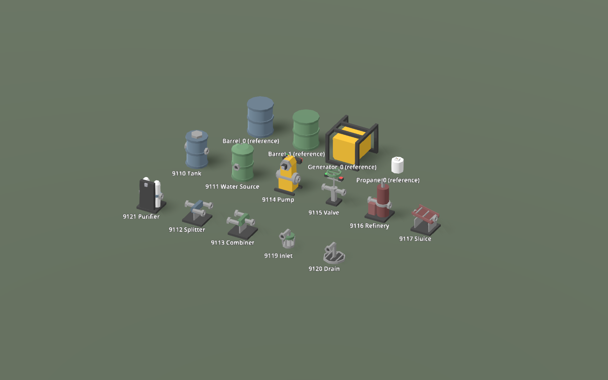

# Fluid deployable art

The reference barrel is **192 `v` records, 96 unique positions, 156 triangles, 12 radial segments, 1.086522 m diameter × 1.321800 m axial height**. Its three bands are 0.100000 m high and project 0.043261 m from the shell. The generator is 140 triangles with a six-sided, radius-0.25 m motor; the hydrant is 200 triangles with six-sided, radius-0.152490 m fittings. These measurements determined the geometry below.

[FLUID_ART_MEASUREMENTS.md](FLUID_ART_MEASUREMENTS.md) contains the direct OBJ survey, including **one table row for each of 2,010 meshes**. The survey was written before the authoring script created vertices. The additional normal and component UV measurements were made while comparing the first render against the reference meshes; they corrected the initial flat-shaded vessel surfaces.

| Population / measurement | Result |
|---|---|
| 551 catalog primary props, `v` min / median / max | 4 / 196 / 6196 |
| Same props, triangles min / median / max | 2 / 114 / 2973 |
| 63 catalog props with largest dimension 0.75–1.75 m and smallest ≥0.35 m, `v` min / median / max | 40 / 140 / 1114 |
| Same size comparison, triangles min / median / max | 20 / 88 / 552 |
| 566 non-LOD object meshes with paired PNGs, referenced texels min / median / max | 0 / 4 / 387; zero means no referenced UV |
| Most frequent palette dimensions | 2×2: 201; 4×2: 140; 2×1: 83 |
| Barrel normal interpolation | 96 side triangles interpolate radial normals; 60 cap triangles have constant normals |
| Barrel LOD0 → LOD1 | 156 → 20 triangles; 12 → 6 sides; bands removed |
| Standing player capsule / eye | 2.000000 / 1.750000 m |

All **11** device defs were completed: 9110–9117, 9119, 9120, 9121. There is no device def 9118 in this range; `MakeFluid` is a factory. No hose anchor moved. Def-less test containers and municipal fixtures retain their existing rendering paths. The legacy `fluid` console verb constructs those test containers, so it still shows primitives; use the placed item IDs or the new `shot.py` scenes to inspect this art.

## Geometry traced to measurements

Triangle counts below include the moving part once. Preview meshes combine body and moving part for the placement ghost; the placed device loads them separately. `v` counts are welded position records, with separate per-corner normal and UV indices. `ParseObj` expands both old and new meshes to three runtime vertices per triangle, so triangle counts are the comparable rendering budget.

| Device | LOD0 triangles, component accounting | Measurement supporting the allocation and detail |
|---|---|---|
| 9110 Tank | **256** = barrel topology 156 + two socket mouths 80 + lid 20 | Barrel_0's 24-triangle shell and three 44-triangle bands; 12 sides. Each hex mouth adds 36 outer/annulus/inner triangles and four recessed back triangles. Lid uses the generator's six-sided 0.25 m radius. |
| 9111 Water Source | **260** = barrel 156 + shoulder 44 + neck 20 + mouth 40 | Same 12-sided barrel; the 12-sided shoulder uses the measured 0.25 m cap radius. Neck bridges the preserved front port at Z=0.55 to the shell. Green RGBs come from Barrel_1. |
| 9114 Pump | **220** = supports/terminal boards 72 + chamber 28 + mouths 80 + separate motor 40 | Generator_0: 140 total and six-sided motor, radius/length 0.25/0.5 m. Chamber has eight sides, as Propane_0. Added motor end belt is 0.1 m long, taken from barrel band thickness. |
| 9115 Valve | **300** = body/pipe/stem/trigger supports 112 + mouths 80 + separate wheel 108 | Body without wheel is 192 triangles versus hydrant 200. Twelve-sided hollow wheel has four annular/profile strips (96 triangles) plus a 12-triangle spoke. Wheel radius 0.3 m comes from the old functional handle; rim/spoke thickness 0.041160 m comes from the propane stem. |
| 9116 Refinery | **232** = base/heater 24 + retort 44 + projecting band 44 + stack 20 + pipe 20 + mouths 80 | Retort uses barrel's 12 sides and generator/propane radius 0.25; band projects the barrel's 0.043261 m. Stack is the hydrant's six-sided 0.088470 m stem radius. Height 1.75 m preserves the former stack envelope. |
| 9117 Sluice | **188** = base/trestles 36 + floor/walls 36 + three riffles 36 + mouths 80 | 188 triangles versus hydrant 200, including 80 for the fixed mouths. Floor/wall thickness 0.041160 m is the measured stem width; riffle height is barrel projection 0.043261 m. Ends fall from Y=0.7 to 0.5, using the existing Y=0.6 ports ± one 0.1 m band. |
| 9121 Purifier | **268** = base/cabinet 24 + two filter profiles 88 + two clamps 56 + pipe 20 + mouths 80 | Filters use propane's eight sides and the hydrant's 0.152490 m radius. Clamps project the barrel's 0.043261 m. Cabinet reaches the unchanged power anchor (0,1.25,0.42). |
| 9112 Splitter | **224** = base/support 24 + manifold 20 + three branches 60 + three mouths 120 | Hex manifold/pipes/fittings use hydrant's six sides. Removing the three functional mouths leaves 104 triangles, between near-size median 88 and generator 140. Branch positions are exactly the existing port fan at Z=±0.32. |
| 9113 Combiner | **224** = same component counts as splitter | Mirrors the actual input/output fan; same measured hex sections and feature dimensions. |
| 9119 Inlet | **232** = two eight-sided strainer ends 56 + eight ribs 96 + riser/neck 40 + mouth 40 | Eight sides and 0.25 m vessel radius from Propane_0; ribs use 0.041160 m measured stem width. Open gaps are geometry. Riser reaches the unchanged (0,0.7,0.55) outlet. |
| 9120 Drain | **192** = bowl/bottom 76 + three grate bars 36 + riser/neck 40 + mouth 40 | Eight-sided tray follows the small-vessel reference; hollow wall projects 0.043261 m and grate bars use 0.041160 m. Existing Y=0.7/Z=0.55 inlet fixes standpipe height and reach. |

| Shared dimension / rule | Derivation |
|---|---|
| Tank/source outer band radius 0.456739 m, shell radius 0.413478 m | Original 0.5 m footprint radius minus one/two measured 0.043261 m projections. This leaves clearance behind the mouths at the fixed ±0.5 m ports, without moving the anchors or allowing the shell to fill their openings. The narrower drum is deliberate; it is not presented as a copied barrel proportion. |
| Tank/source barrel shell Y=0.05–1.3 | 1.25 m axial span, equal to the measured barrel shell; lower half-band 0.05 m, upper end = 1.4 m old envelope minus 0.1 m lid/shoulder. |
| Tank/source bands Y=0–0.1, 0.6–0.7, 1.2–1.3 | Each 0.1 m thick; middle band ends at the original 0.7 m port elevation; end bands terminate shell/base. |
| Socket outer / bore radius | 0.152490 / 0.088470 m, the hydrant's two measured hex radii; six segments. Recess = barrel projection 0.043261 m; outer depth = band thickness 0.1 m. |
| Skids, pedestals, boards, pipes | Layout follows old 0.9 m fitting envelope, Y=0.6 hose axes, and X=±0.32 / Y=1.2 or 1.25 / Z=±0.42 electrical anchors. These are functional layout constraints, not purported measurements of retail machine internals. |
| Supports/rims/grates | 0.041160 m minimum authored width; 0.1 m bands; no added bolt arrays, text decals, surface scratches, or sub-centimetre bevels. |
| Normal treatment | Radial per-corner normals on eight/twelve-sided curved walls; caps and annuli use explicit face normals. Six-sided fittings, motors, and LOD1 walls use constant face normals. |

## Materials and moving parts

Each device has a **2×2 PNG**, sampled by per-corner UV. The tank/source use the reference barrel assignment: light shell (72 reference corners), dark bands (396 reference corners). All triangles have a single texel-centre UV: OBJ `(0.25,0.75)` becomes `(0.25,0.25)` after `ParseObj` flips V. No `usemtl`, colour-per-vertex, or device-body `AlbedoColor` supplies the art. Materials use nearest filtering, roughness 1, white modulation, and backface culling with clockwise faces and explicit outward normals.

| Device palette | Exact RGB source |
|---|---|
| Tank / Splitter | Barrel_0 (87,104,118), (99,119,135); Generator_0 metal (59,59,59), (138,138,138) |
| Source / Combiner / Inlet | Barrel_1 (87,119,90), (99,135,102); same generator metals |
| Pump | Generator_0 yellow (213,167,44), two metals; Barrel_0 (99,119,135) occupies the unused fourth texel |
| Valve | Barrel_1 green (99,135,102), Fire_Hydrant_0 red (162,32,32), two generator metals |
| Refinery / Sluice / Drain | Barrel_2 (112,68,68), (131,87,87), two generator metals |
| Purifier | Propane_0 white (219,219,219), Barrel_0 (99,119,135), two generator metals |

`PumpDrum` is still `_pumpDrum`, at the original **(0,1.25,0)** pivot. Existing drive-gated vibration and its **0.01 m amplitude** remain intact. Its LOD1 is a child, so both mesh levels inherit the same motion. The collision envelope includes the upper 0.01 m travel; other axes already fit inside the static body bounds.

`ValveHandle` is a separate mesh with a child LOD1. Its pivot is now **(0,1.4,0)**, 0.2 m above the old primitive: two measured band heights clear the unchanged trigger housings at Y=1.2. The previous code only changed colour. Manual toggles and `SetValveOpen` now also rotate the spoke **90° over 0.2 seconds**. The angle follows the flow gate; the duration is a new animation timing choice, not an art measurement. Closing shifts the handle UV by +0.5 U onto the measured red texel; reopening restores green. The per-instance handle material is shared with its own LOD1, without recolouring other valves.

## Placement bounds and LODs

Before this change every def had Size `(1,1.4,1)`, Offset `0.7`, Radius `0.5`, and Upright `false`. The geometry was Y-up but the ghost applied the legacy X stand-up rotation. All authored defs now have **Upright=true, ProcBox=false**. Size and the placed box collider come from the generated catalog. Collider centre = bounds minimum + Size/2; this matters for front-only fittings. Offset is half the collider height. Radius is the minimum of 0.5 m, half-width, half-depth, and Offset−0.041160 m, preserving the clearance-sphere rule while keeping it above the supporting floor.

Hose anchors and the six existing electrical anchors across pump, valve, and purifier did not move. No capacity, rate, head lift, quality conversion, or submerged depth requirement changed. The inlet still requires 0.6–5 m water depth.

The lower meshes use the barrel's **0.20415 screen-height split**, through `LodTable.DistanceForHeight` with source FOV 60° and the existing draw-distance bias. Formula: `max(bounds size)/(2×0.20415×tan(30°))×LodBias`; `LodBias=2+3×clamp(DrawDistance,0,1)`, default 5. Tank split is about 29.695 m at that default. Unlike world props, deployed devices are not culled at the second retail height: LOD1 remains visible, with hose nodes and colliders independent of render distance. Bands, riffles, open strainer ribs and the open wheel are omitted/simplified in LOD1; functional fitting silhouettes remain, explaining the higher totals than a bare 20-triangle barrel LOD.

<!-- generated bounds and asset inventory follow -->

| ID | Welded v (LOD0) | Tris LOD0 / LOD1 | Collider Size XYZ (m) | Bounds minimum XYZ (m) | Offset (m) | Radius (m) | Height / 2 m player |
|---|---:|---:|---|---|---:|---:|---:|
| 9110 | 156 | 256 / 80 | 1.000000, 1.400000, 0.913478 | -0.500000, 0.000000, -0.456739 | 0.700000 | 0.456739 | 0.700000 |
| 9111 | 144 | 260 / 80 | 0.913478, 1.400000, 1.006739 | -0.456739, 0.000000, -0.456739 | 0.700000 | 0.456739 | 0.700000 |
| 9114 | 130 | 220 / 152 | 1.000000, 1.476506, 0.840000 | -0.500000, 0.000000, -0.420000 | 0.738253 | 0.420000 | 0.738253 |
| 9115 | 176 | 300 / 172 | 1.000000, 1.450000, 0.600000 | -0.500000, 0.000000, -0.300000 | 0.725000 | 0.300000 | 0.725000 |
| 9116 | 136 | 232 / 124 | 1.000000, 1.750000, 0.900000 | -0.500000, 0.000000, -0.450000 | 0.875000 | 0.450000 | 0.875000 |
| 9117 | 120 | 188 / 112 | 1.000000, 0.841160, 0.900000 | -0.500000, 0.000000, -0.450000 | 0.420580 | 0.379420 | 0.420580 |
| 9121 | 156 | 268 / 148 | 1.000000, 1.338470, 0.900000 | -0.500000, 0.000000, -0.450000 | 0.669235 | 0.450000 | 0.669235 |
| 9112 | 136 | 224 / 164 | 1.000000, 0.752490, 0.904120 | -0.500000, 0.000000, -0.452060 | 0.376245 | 0.335085 | 0.376245 |
| 9113 | 136 | 224 / 164 | 1.000000, 0.752490, 0.904120 | -0.500000, 0.000000, -0.452060 | 0.376245 | 0.335085 | 0.376245 |
| 9119 | 142 | 232 / 120 | 0.541160, 0.832060, 0.820580 | -0.270580, 0.000000, -0.270580 | 0.416030 | 0.270580 | 0.416030 |
| 9120 | 110 | 192 / 116 | 0.913478, 0.832060, 1.006739 | -0.456739, 0.000000, -0.456739 | 0.416030 | 0.374870 | 0.416030 |

## Every mesh file and its checked AABB

The JSON receipt [FLUID_MESH_BOUNDS.json](FLUID_MESH_BOUNDS.json) records these same bounds and the triangle count for each named component. Part bounds are local to the pivots above. Body/preview bounds are in the placed Y-up frame.

| File under game/content/fluid/ | v | Tris | Min XYZ (m) | Max XYZ (m) |
|---|---:|---:|---|---|
| [9110_body.txt](../game/content/fluid/9110_body.txt) | 156 | 256 | -0.500000, 0.000000, -0.456739 | 0.500000, 1.400000, 0.456739 |
| [9110_body_lod1.txt](../game/content/fluid/9110_body_lod1.txt) | 48 | 80 | -0.500000, 0.000000, -0.395548 | 0.500000, 1.400000, 0.395548 |
| [9111_body.txt](../game/content/fluid/9111_body.txt) | 144 | 260 | -0.456739, 0.000000, -0.456739 | 0.456739, 1.400000, 0.550000 |
| [9111_body_lod1.txt](../game/content/fluid/9111_body_lod1.txt) | 42 | 80 | -0.456739, 0.000000, -0.395548 | 0.456739, 1.400000, 0.550000 |
| [9114_body.txt](../game/content/fluid/9114_body.txt) | 112 | 180 | -0.500000, 0.000000, -0.420000 | 0.500000, 1.338470, 0.420000 |
| [9114_part.txt](../game/content/fluid/9114_part.txt) | 18 | 40 | -0.250000, -0.216506, -0.250000 | 0.250000, 0.216506, 0.250000 |
| [9114_preview.txt](../game/content/fluid/9114_preview.txt) | 130 | 220 | -0.500000, 0.000000, -0.420000 | 0.500000, 1.466506, 0.420000 |
| [9114_body_lod1.txt](../game/content/fluid/9114_body_lod1.txt) | 84 | 132 | -0.500000, 0.000000, -0.420000 | 0.500000, 1.338470, 0.420000 |
| [9114_part_lod1.txt](../game/content/fluid/9114_part_lod1.txt) | 12 | 20 | -0.250000, -0.216506, -0.250000 | 0.250000, 0.216506, 0.250000 |
| [9114_preview_lod1.txt](../game/content/fluid/9114_preview_lod1.txt) | 96 | 152 | -0.500000, 0.000000, -0.420000 | 0.500000, 1.466506, 0.420000 |
| [9115_body.txt](../game/content/fluid/9115_body.txt) | 120 | 192 | -0.500000, 0.000000, -0.250000 | 0.500000, 1.379420, 0.250000 |
| [9115_part.txt](../game/content/fluid/9115_part.txt) | 56 | 108 | -0.300000, -0.050000, -0.300000 | 0.300000, 0.050000, 0.300000 |
| [9115_preview.txt](../game/content/fluid/9115_preview.txt) | 176 | 300 | -0.500000, 0.000000, -0.300000 | 0.500000, 1.450000, 0.300000 |
| [9115_body_lod1.txt](../game/content/fluid/9115_body_lod1.txt) | 96 | 152 | -0.500000, 0.000000, -0.250000 | 0.500000, 1.379420, 0.250000 |
| [9115_part_lod1.txt](../game/content/fluid/9115_part_lod1.txt) | 12 | 20 | -0.300000, -0.050000, -0.259808 | 0.300000, 0.050000, 0.259808 |
| [9115_preview_lod1.txt](../game/content/fluid/9115_preview_lod1.txt) | 108 | 172 | -0.500000, 0.000000, -0.259808 | 0.500000, 1.450000, 0.259808 |
| [9116_body.txt](../game/content/fluid/9116_body.txt) | 136 | 232 | -0.500000, 0.000000, -0.450000 | 0.500000, 1.750000, 0.450000 |
| [9116_body_lod1.txt](../game/content/fluid/9116_body_lod1.txt) | 76 | 124 | -0.500000, 0.000000, -0.450000 | 0.500000, 1.750000, 0.450000 |
| [9117_body.txt](../game/content/fluid/9117_body.txt) | 120 | 188 | -0.500000, 0.000000, -0.450000 | 0.500000, 0.841160, 0.450000 |
| [9117_body_lod1.txt](../game/content/fluid/9117_body_lod1.txt) | 72 | 112 | -0.500000, 0.000000, -0.450000 | 0.500000, 0.841160, 0.450000 |
| [9121_body.txt](../game/content/fluid/9121_body.txt) | 156 | 268 | -0.500000, 0.000000, -0.450000 | 0.500000, 1.338470, 0.450000 |
| [9121_body_lod1.txt](../game/content/fluid/9121_body_lod1.txt) | 88 | 148 | -0.500000, 0.000000, -0.450000 | 0.500000, 1.338470, 0.450000 |
| [9112_body.txt](../game/content/fluid/9112_body.txt) | 136 | 224 | -0.500000, 0.000000, -0.452060 | 0.500000, 0.752490, 0.452060 |
| [9112_body_lod1.txt](../game/content/fluid/9112_body_lod1.txt) | 100 | 164 | -0.500000, 0.000000, -0.452060 | 0.500000, 0.752490, 0.452060 |
| [9113_body.txt](../game/content/fluid/9113_body.txt) | 136 | 224 | -0.500000, 0.000000, -0.452060 | 0.500000, 0.752490, 0.452060 |
| [9113_body_lod1.txt](../game/content/fluid/9113_body_lod1.txt) | 100 | 164 | -0.500000, 0.000000, -0.452060 | 0.500000, 0.752490, 0.452060 |
| [9119_body.txt](../game/content/fluid/9119_body.txt) | 142 | 232 | -0.270580, 0.000000, -0.270580 | 0.270580, 0.832060, 0.550000 |
| [9119_body_lod1.txt](../game/content/fluid/9119_body_lod1.txt) | 58 | 120 | -0.250000, 0.000000, -0.216506 | 0.250000, 0.832060, 0.550000 |
| [9120_body.txt](../game/content/fluid/9120_body.txt) | 110 | 192 | -0.456739, 0.000000, -0.456739 | 0.456739, 0.832060, 0.550000 |
| [9120_body_lod1.txt](../game/content/fluid/9120_body_lod1.txt) | 64 | 116 | -0.456739, 0.000000, -0.395548 | 0.456739, 0.832060, 0.550000 |

## Other files added or changed

| File | Change |
|---|---|
| `game/DeployableDef.cs` | Configure all 11 fluid defs from the authored catalog; shared preview/palette path; upright ghosts. |
| `game/FluidContainer.cs` | Authored branch preserves ports, billboard, `_pumpDrum` drive logic; separate valve handle follows open/closed state. Existing def-less fallback retained. |
| `game/FluidArt.cs` | Runtime catalog, bounds, ParseObj meshes, cached palette materials, separate parts and LOD bindings. |
| `game/Main.cs` | Route `UG_FLUIDART` through the existing `--fluidtest` flag; arm the shared screenshot capture. |
| `game/Main.FluidArt.cs` | Place actual defs in reference gallery, individual close views, lower-LOD view, and wired uphill fluid circuit. |
| `game/testing/tests/FluidArtTests.cs` | Real placement aim/factory, port raycasts, meshes/bounds/materials, every branch flowing, real generator power, pump and valve transform/state checks. |
| `game/content/fluid/catalog.json` | Generated names, colour RGBs, bounds, placement dimensions, pivots and mesh/component counts. |
| `game/content/fluid/9110_palette.png` | 2×2 palette from the RGB sources above. |
| `game/content/fluid/9111_palette.png` | 2×2 palette from the RGB sources above. |
| `game/content/fluid/9114_palette.png` | 2×2 palette from the RGB sources above. |
| `game/content/fluid/9115_palette.png` | 2×2 palette from the RGB sources above. |
| `game/content/fluid/9116_palette.png` | 2×2 palette from the RGB sources above. |
| `game/content/fluid/9117_palette.png` | 2×2 palette from the RGB sources above. |
| `game/content/fluid/9121_palette.png` | 2×2 palette from the RGB sources above. |
| `game/content/fluid/9112_palette.png` | 2×2 palette from the RGB sources above. |
| `game/content/fluid/9113_palette.png` | 2×2 palette from the RGB sources above. |
| `game/content/fluid/9119_palette.png` | 2×2 palette from the RGB sources above. |
| `game/content/fluid/9120_palette.png` | 2×2 palette from the RGB sources above. |
| `tools/measure_fluid_art.py` | Parses old OBJ/TXT files directly; full any-orientation regular-ring edge scan, UV sampling and distribution tables; writes optional raw JSON to `.verify/`. |
| `tools/fluid_art_measurement_details.md` | Numeric component, code-footprint, palette, LOD and normal observations included by the survey script. |
| `tools/author_fluid_art.py` | Measurement-gated deterministic authored mesh/palette/catalog generation. |
| `tools/verify_fluid_art.py` | Reparse every delivered mesh using ParseObj semantics; strict indices/triangles/UV/normal/winding/area/AABB checks and all 21 socket mouths. |
| `tools/shot.py` | Add `fluid`, `fluiddevice`, `fluidlod`, `fluidclosed`, `fluidflow` to SCENES. |
| `notes/FLUID_ART_MEASUREMENTS.md` | Pre-authoring survey and numeric comparison tables; additional normal measurement after first render comparison. |
| `notes/FLUID_MESH_BOUNDS.json` | Per-file bounds/count/component receipt, consumed by validator. |
| `notes/FLUIDIO_REPORT.md` | This report. |
| `notes/fluid_art/9110.png` | Inspected LOD0 render of placed device 9110. |
| `notes/fluid_art/9111.png` | Inspected LOD0 render of placed device 9111. |
| `notes/fluid_art/9114.png` | Inspected LOD0 render of placed device 9114. |
| `notes/fluid_art/9115.png` | Inspected LOD0 render of placed device 9115. |
| `notes/fluid_art/9116.png` | Inspected LOD0 render of placed device 9116. |
| `notes/fluid_art/9117.png` | Inspected LOD0 render of placed device 9117. |
| `notes/fluid_art/9121.png` | Inspected LOD0 render of placed device 9121. |
| `notes/fluid_art/9112.png` | Inspected LOD0 render of placed device 9112. |
| `notes/fluid_art/9113.png` | Inspected LOD0 render of placed device 9113. |
| `notes/fluid_art/9119.png` | Inspected LOD0 render of placed device 9119. |
| `notes/fluid_art/9120.png` | Inspected LOD0 render of placed device 9120. |
| `notes/fluid_art/tank-lod1.png` | Inspected device 9110 beyond its actual LOD split. |
| `notes/fluid_art/9111-lod1.png` | Inspected device 9111 beyond its actual LOD split. |
| `notes/fluid_art/pump-lod1.png` | Inspected device 9114 beyond its actual LOD split. |
| `notes/fluid_art/9115-lod1.png` | Inspected device 9115 beyond its actual LOD split. |
| `notes/fluid_art/9116-lod1.png` | Inspected device 9116 beyond its actual LOD split. |
| `notes/fluid_art/9117-lod1.png` | Inspected device 9117 beyond its actual LOD split. |
| `notes/fluid_art/9121-lod1.png` | Inspected device 9121 beyond its actual LOD split. |
| `notes/fluid_art/9112-lod1.png` | Inspected device 9112 beyond its actual LOD split. |
| `notes/fluid_art/9113-lod1.png` | Inspected device 9113 beyond its actual LOD split. |
| `notes/fluid_art/9119-lod1.png` | Inspected device 9119 beyond its actual LOD split. |
| `notes/fluid_art/9120-lod1.png` | Inspected device 9120 beyond its actual LOD split. |
| `notes/fluid_art/gallery.png` | All 11 placed devices with four measured retail references. |
| `notes/fluid_art/valve-closed.png` | Turned spoke and red handle texel after closing. |
| `notes/fluid_art/flow.png` | Real generator → pump, source → pump → valve → elevated tank. |
| `notes/fluid_art/verification.txt` | Build, mesh validator, in-engine tests, fresh-capture records and asset hashes. |

## Verification and reproduction

| Check | How | Result |
|---|---|---|
| Build | `dotnet build game/UnturnedGodot.csproj` | Final incremental build: success, 0 warnings, 0 errors. Full recompiles emitted 22 warnings in existing code; no new warning diagnostic was introduced. |
| Mesh safety | `python3 tools/verify_fluid_art.py` | 30 files, 4,872 triangles across body/part/preview/LOD files; all indices in range, exactly three corners per face, nonzero triangle area, finite unit normals with outward/clockwise agreement, exact centre UVs after V flip, no cross-cell interpolation, all AABBs match the receipt. |
| Palette role assignment | Validator samples new vessel/band faces through the loader's V flip and compares to the original barrel PNGs | Tank/source shell and band colours match the measured reference assignment. |
| Hose mouths | Validator independently uses the 21 original anchor positions and finds all six bore-rim vertices at every mouth plane | 21 / 21 unchanged anchors have physical fittings. |
| Fluid regression slice | `UG_TEST_RESULTS=.verify/fluid-final ./test.sh --l1 --only 'fluid.*'` | 10 / 10 tests passed, including 147 art-placement/flow checks. |
| Art test after geometry refinement | `UG_TEST_RESULTS=.verify/fluid-art-final ./test.sh --l1 --only 'fluid.art*'` | 147 / 147 passed. Real floor aim and placement for every def, including inlet depth 1 m; yaw 37°; each port ray resolves its own HosePort; every input/output branch moves or consumes fluid. |
| Pump/purifier power | Same art test, real placed generator, Wire and PowerNet; no forced power for those authored devices | Both electrical inlets powered; purifier produces clean water; pump flows, vibrates on successive ticks, and returns to (0,1.25,0) on power loss. |
| Valve | Manual close plus real wired OPEN/CLOSE trigger ports | Intermediate and final wheel angles checked; closed blocks flow, wired reopening resumes flow; green/red UV offsets checked. |
| Inlet and transformations | Same art test | Inlet supplies through a pump; refinery output has gas type; sluice output dirty; purifier output clean; every connected splitter/combiner branch receives fluid. |
| Rendered circuit | `python3 tools/shot.py fluidflow` | `power=True`, `drive=True`, elevated tank received **1250 mL** after twenty 0.1 s FluidNet ticks. Drum observed at **(0.009977427,1.2595209,0.007720116)** versus rest (0,1.25,0). |
| Visual inspection | `shot.py fluid`, every ID through `fluiddevice` and `fluidlod`, plus `fluidclosed` and `fluidflow`; xvfb + Vulkan + movie mode | 25 saved and inspected final frames: gallery 1600×1000; individual views 900×900; circuit 1280×800. Lower views put the camera 10 m beyond the actual configured split; the gallery explicitly forces LOD0 for comparison. |



[Pump](fluid_art/9114.png), [open valve](fluid_art/9115.png), [closed valve](fluid_art/valve-closed.png), [powered circuit](fluid_art/flow.png), [tank LOD1](fluid_art/tank-lod1.png). All remaining close views and lower views are listed above.

To regenerate the assets and re-check them, run in this worktree:

```bash
python3 tools/measure_fluid_art.py
python3 tools/author_fluid_art.py
python3 tools/verify_fluid_art.py
dotnet build game/UnturnedGodot.csproj
./test.sh --l1 --only 'fluid.*'
python3 tools/shot.py fluid
DEVICE=9114 python3 tools/shot.py fluiddevice
DEVICE=9114 python3 tools/shot.py fluidlod
python3 tools/shot.py fluidclosed
python3 tools/shot.py fluidflow
```

## Limits of verification

- I did not manually operate the inventory, mouse placement, hose tool, or F key in a live play session. The tests call the real aim/placement factory, physics port rays, manual-toggle method, electrical signal graph and fluid solver. They verify transforms over ticks; the delivered visual evidence is still frames, not an animation video.
- I did not render these in the full island world, underwater, at night, in multiplayer, or on a hardware GPU. Inlet placement depth was tested numerically through the real aim path; its dry studio view exposes the strainer geometry. Captures used the repository's llvmpipe/Vulkan path.
- The renderer produced fresh, nonblank PNGs, then logged the engine's `finalize can only be called from the render thread` shutdown error. One retained capture log also contains `p_image.is_null() || p_image->is_empty()`; its final viewport PNG was saved and inspected. Engine runs emitted ObjectDB/RID cleanup warnings as well. These are recorded in the evidence; I did not establish or fix their underlying cause and do not claim a clean Godot shutdown. The C# build succeeds.
- The ring scan is exhaustive over the listed mesh files for regular closed 5–64-sided edge rings, including tilted rings. It does not classify partial arcs, ellipses, deformed organic sections, or four-sided prisms as rings; `0 detected` in the measurements is not proof that a mesh has no curved surface.
- The complete non-fluid game test suite was not run. No multiplayer deployment or push was performed.

---

# Revision 2 — strawberry's pass, 2026-09-10

> "the water tank should just be a barrel with those hose connections. the purifier, refinery, pump and
> sluice should be much bigger (keeping the Io pipes the same size.). fill gaps and weird edges and
> inconsistent geometry, and any gaps/holes. change the valve handle to be red and more accurate to a
> real valve. also make sure it has an animated turn on/off animation. the pump should have some part
> of it that spins, but making sense."

## The barrel is now Barrel_0's own profile, not an approximation of it

Read straight off the retail OBJ (source Z-up, translated to sit on Y=0):

| | shell radius | band radius | bands (axial) |
|---|---|---|---|
| Barrel_0, measured | 0.500000 | 0.543261 | 0–0.1, 0.641859–0.741859, 1.2218–1.3218, end pair straddling the caps |
| was | 0.456739 | 0.500000 | 0, 0.6, 1.2, none straddling |

`0.543261 − 0.043261 == 0.500000` exactly, so the unchanged ±0.5 hose anchors land precisely on a true
barrel's shell — the drum had been one band-projection too narrow, which is what made it read slim next
to the reference.

The fittings moved DOWN to y=0.45. At 0.7 they sat dead-centre on the middle rolling hoop and came out
half-buried in it.

## The four machines

Envelopes, with every HEX/BORE fitting untouched:

| | was | now |
|---|---|---|
| Pump 9114 | 1.36 × 1.48 × 0.84 | **1.96 × 1.41 × 1.10** |
| Refinery 9116 | 1.36 × 1.75 × 0.90 | **1.96 × 2.78 × 1.04** |
| Sluice 9117 | 1.36 × 0.84 × 0.90 | **2.20 × 1.05 × 1.00** |
| Purifier 9121 | 1.36 × 1.34 × 0.90 | **2.06 × 1.95 × 1.04** |

Because the fittings deliberately did not grow, the hose anchors had to travel out to the new body
sides (`portX` in the catalog; 0.80 / 0.80 / 0.92 / 0.85). Two things fell out of that and both were
caught by rendering it rather than by reasoning about it:

- **the spigots floated in mid-air**, because nothing bridged body to anchor. Every port now has a stub
  pipe off the body wall.
- **the refinery's cross-pipe skewered its own vessel** — one pipe spanning the full width ran straight
  through the retort and out the far side. It is two stubs now, one per port.

The sluice's trough FALLS along its length, so its two ends are at different heights while every device
presents its hose at one height; end headers bridge that rather than moving the port and breaking the
level hose run.

## Gaps, holes and inconsistent geometry

`tools/audit_fluid_geometry.py` is new. It splits each mesh into connected solids and requires each to
be closed on its own — overlapping solids are correct and deliberate here, so "not watertight as one
surface" is not the defect; a solid with edges used once is. It also reports degenerate triangles,
non-manifold seams, normals that oppose their winding, and near-but-unwelded vertices.

| | before | after |
|---|---|---|
| meshes with findings | **30 of 30** | **0 of 30** |

What it found:

- **every mesh was wound backwards relative to the rest of the game.** Measured against the retail art:
  Barrel_0 has its face normal agreeing with its winding 156/156 and Generator_0 132/132; these were
  0/256. They were the only meshes in the game built that way. `verify_fluid_art.py` had been asserting
  the backwards convention, so it agreed with them — its assert is flipped and cites the measurement.
- **the recessed hose mouths were open**, 6 boundary edges each and the single most common finding.
  They are protruding closed spigots now, which also fixes a mouth that a barrel band sat in front of.
- the drain bowl was an open lathe welded flush to a separate disc: one closed solid now.
- the inlet's strainer cage butted flush into its end caps, putting four faces on the shared ring; it
  overlaps them instead.

## Valve and pump

**Valve** — red handwheel in BOTH states: a rim, a hub and five spokes, on a chunkier flanged body
(the first attempt read as a lollipop). The colour no longer carries the state; the TURN does, and it
is 2.5 turns over ~1.1 s like a real gate valve rather than the old quarter turn in 0.2 s.

**Pump** — the part that spins is the BELT PULLEY on the motor shaft, with a belt down to a sheave on
the volute shaft, so it is visibly driving the casing the fluid crosses. The old animation jittered the
whole motor drum on the spot, which is not a thing a pump does. It spins down rather than stopping dead.

**A readback bug found by the tests, not by me.** Both animations originally read the angle back off
`Rotation.Y` and stepped from there. Godot normalises euler angles to (−π, π], so a 5π target is
unreachable and `MoveToward` chases a value that wraps underneath it; and once the pulley is stood
upright a local-Y spin does not appear in `Rotation.Y` at all. Both parts now keep their own accumulated
angle and WRITE the transform, never reading it back.

## Verified

- `dotnet build` clean; `./test.sh --l1 --only 'fluid.*'` **10 passed, 0 failed**.
- `audit_fluid_geometry.py`: 30 meshes, 6976 triangles, 0 findings.
- `verify_fluid_art.py`: 21 hose anchors each carry a modelled spigot collar — read from the catalog
  the game itself reads, so mesh and port cannot silently drift apart. That check caught a real
  mismatch mid-pass: the inlet and drain meshes were at 0.7 while their published port had moved to 0.6.
- Rendered and looked at: gallery, pump, tank, closed valve, powered circuit.

## Not verified

- No hardware GPU, no night, no full island world, no multiplayer. Software Vulkan under xvfb.
- Stills only. The valve turn and the pulley spin are asserted numerically over ticks; I have not
  watched either as video.
- The non-fluid test suite was not run.

## Second art pass — 2026-09-10

The supplied front and 90° sheets exposed daylight between the manifold branches and their collars,
and between the inlet/drain necks and their collars. Their runs ended at 0.40/0.45 m while their
collars started at 0.50/0.55 m: **100 mm gaps**. The valve had the same fault at 0.42 → 0.50 m:
**80 mm gaps**. The three-quarter projection overlapped these disconnected pieces on screen. The
pump and refinery in this checkout already include the review's separate stubs; I did not rediscover
the earlier floating pump or cross-vessel skewer in these supplied meshes. The remaining curved-skin
joins still needed broad seats instead of a flat hexagon touching a round body at its outermost point.

The original fifth view is useful for silhouettes, but its +6° elevation still looks downward, with
the ground obscuring the bottom. The contact sheets now retain all five views and add **145° azimuth,
−22° elevation with the ground hidden**, so the underside can actually be inspected. Individual shots
explicitly select LOD0 unless LOD1 is requested. Failed captures cannot silently reuse old frames.

**Winding convention remains clockwise-front.** Explicit outward normals oppose the stored triangle
winding. The earlier paragraph in this report claiming that the retail file convention was correct
is superseded: `ObjMesh.Load` and `ContentProvider.ParseObj` have different winding transformations.
Neither the existing winding emitter nor the audit's convention was changed in this pass.

### Geometry and measurements

| Change | Measurement and resulting geometry |
|---|---|
| Curved-body seats | Collar radius stays **0.152490 m**, spout radius **0.1282815 m**, collar/spout lengths **0.06/0.12 m**. Boss radius is collar + measured barrel lip = **0.195751 m**. Each boss starts inside the body by its circular sag + polygon sag + **25 mm**. A triangulated loft transitions from the body's **12/8 segments to 6**, with a six-sided continuation into the collar. LOD1 uses six-sided seats. |
| Fitting joins | Supporting solids extend **25 mm into each collar**, rather than ending at its back plane. Tanks/source, pump, valve, refinery, sluice and purifier use the new seats; manifold runs and swept endpoints also overlap their collars. The verifier samples the centre and six points on a **70 mm radius**, **12 mm inside** every collar, requiring non-fitting geometry at every point. It checks both LODs as well as the published six-vertex anchor ring. |
| Inlet and drain elbows | Preserve the existing **0.088470 m run radius**. A **0.18 m centreline-radius, 90° bend** has six 15° steps at LOD0 and three 30° steps at LOD1, with tangent vertical/horizontal runs in one capped solid. The run transitions to the existing spout radius before entering the fitting at Z=0.55. |
| Refinery | Envelope **1.96 × 2.78 × 1.04 → 2.56 × 3.64 × 1.40 m**: +30.61% width, +30.94% height, +34.62% depth. Retort radius **0.44 → 0.58 m**; shell/shoulder reaches Y=2.82. Three **0.12 m** bands begin at Y=0.94, 1.72 and 2.48. The cap ends at Y=2.90; the flared stack reaches Y=3.64 with a **0.18 m shaft radius**. The larger firebox has a visible door. Inlet terminates in the firebox; discharge has its own retort seat. There is no pipe spanning through the retort. |
| Splitter/combiner | Each now has **four hose ports**: 1:3 / 3:1. A collector widens from a **0.24 m throat to a 0.88 m branch face**, instead of a uniform cross-manifold. Three hex branches use **0.32 m pitch**, leaving **55.9 mm** between the collars' Z silhouettes. Each branch enters the collector and overlaps its fitting; its gland and run both use six sides. |
| Inlet cage | Eight radial ribs at uniform **45° spacing**, centred on the octagon's faces. Each is **40 mm radial depth × 41.16 mm tangential thickness × 250 mm height**, with **20 mm overlap into both caps**. Outer rib face radius **0.228 m** stays inside the cap apothem **0.230970 m**. The top is lowered from **0.50 to 0.38 m** to leave room for the real elbow while preserving the Y=0.60 hose anchor. Overall cage width drops from the irregular **0.541160 to 0.500000 m**. |
| Drain grate | Bars previously floated at Y=0.10 over the Y=0.05 floor and stopped before the rim. They now begin at **Y=0.075** and extend **±0.48 m** (centre) / **±0.385 m** (outer pair) into the bowl wall. The central riser foot overlaps the bowl floor and supports the middle bar. The bowl remains a closed solid. |
| Pump belt / preview | A six-sided **0.15 m** sheave reaches Z=±0.129904, but the old straps began at \|Z\|=0.172: a **42.1 mm miss**. Sloped straps now bridge centres at \|Z\|≈0.14 and 0.245 between the lower and upper pulleys. The preview and dropped model also apply the catalog's **−90° Z rotation** to the pump pulley, matching the placed assembly instead of leaving it horizontal. |
| Electrical input backing | The new pump side sheet still showed its grey power cube floating away from the motor; the purifier used the same unsupported anchor. Both cubes are **0.13 m wide at (0, 1.25, 0.42)**, with inner face Z=0.355. New glands run into the motor/cabinet and end at **Z=0.385 / 0.39**, overlapping the cubes by **30 / 35 mm**. Their electrical anchors do not move. |

The refinery's published **portX changes from 0.80 to 1.10 m**; portY stays 0.60. All other existing
anchor coordinates are retained. Splitter/combiner `branchZ` is now published as **[−0.32, 0, +0.32]**
in `catalog.json`, and `FluidContainer.Fan()` reads it. `BuildPorts` now sends branch X/Y through
`FluidArt.Port` too. Their deployable defs set `FluidWays=3`, and item descriptions say three hoses.
Port count and all branches' actual flow are exercised by the existing placement/flow test.

| Device | LOD0 / LOD1 triangles, before → after | Dropped OBJ dimensions, metres |
|---|---|---|
| 9110 Tank | 264 / 60 → 376 / 124 | 0.680000 × 0.660900 × 0.543260 |
| 9111 Water Source | 240 / 60 → 276 / 72 | 0.543260 × 0.660900 × 0.636630 |
| 9112 Splitter | 236 / 164 → 380 / 284 | 0.680000 × 0.376244 × 0.510000 |
| 9113 Combiner | 236 / 164 → 380 / 284 | 0.680000 × 0.376244 × 0.510000 |
| 9114 Pump | 660 / 288 → 736 / 348 | 0.872200 × 0.623000 × 0.489500 |
| 9115 Valve | 492 / 252 → 596 / 340 | 0.680000 × 0.745000 × 0.300000 |
| 9116 Refinery | 360 / 176 → 572 / 284 | 0.613416 × 0.872200 × 0.335462 |
| 9117 Sluice | 272 / 176 → 296 / 200 | 0.872200 × 0.416278 × 0.396454 |
| 9118 Hose Tool | item only, 376 triangles | 0.581200 × 0.556000 × 0.196930 |
| 9119 Inlet | 236 / 120 → 324 / 172 | 0.250000 × 0.366030 × 0.490000 |
| 9120 Drain | 180 / 104 → 288 / 176 | 0.500000 × 0.366030 × 0.615000 |
| 9121 Purifier | 364 / 180 → 440 / 240 | 0.872200 × 0.825626 × 0.440334 |

### Inventory and dropped items

Measured all **1,862 existing icons**: 1,177 are 256×256, with a 256 px long edge throughout the set.
Sample alpha bounds: Generator 458 **(1,13)–(255,243)** on 256²; Gas Can 28 **(1,1)–(256,255)** on 256²;
Blowtorch 76 **(13,0)–(115,255)** on 128×256. All twelve fluid items have square inventory cells, so
their new icons are **256×256 RGBA**, centred with the rendered silhouette's long edge at **254 px**.
`shot.py fluidicon` renders a single manifest model in Godot against transparency, with back-face
culling enabled; Pillow only crops transparent margins and downsamples that render. These are not
drawn approximations. `python3 tools/fluid_item_icons.py` generates all twelve and a review sheet at
`notes/fluid_art/item_icons.png`.

The existing dropped Rain Barrel 1208 measures **0.56 × 0.75 × 0.6466 m**; Portable Generator 458
measures **0.7635 × 0.6819 × 0.8722 m**. Their manifest has no separate scale field: dimensions are
baked into the mesh. The new device drops use **min(0.5, 0.8722 / longest placed dimension)**, with
their complete LOD0 assembly centred at the origin. Thus the 3.64 m refinery becomes 0.8722 m tall,
and the pump becomes 0.8722 m wide. Each has its own `.obj`, palette PNG and exact box/centre entry
under `game/content/items/`. The existing manifest entries are semantically unchanged.

9118 is handled separately as a **coiled hose with two metal couplings**, not as a device: two
12-section closed coils with six-sided tube cross-sections. It has an icon, palette and dropped OBJ,
and no deployable def or extra mesh in the 30-mesh fluid catalog.

### Verification and limits

- `python3 tools/author_fluid_art.py`: regenerated all device and item assets. A second regeneration
  was checked by SHA-256 across 68 mesh/palette/metadata files and produced byte-identical files.
- `python3 tools/audit_fluid_geometry.py`: **30 meshes, 9,208 triangles, 0 with findings**.
- `python3 tools/verify_fluid_art.py`: **23 connected hose anchors at both LODs**, palette/bounds/
  explicit-normal/triangle checks passed; **all 12 item meshes and RGBA icons passed**. The dropped
  models also passed closure checks and a separate positive-outward-volume check per solid.
- `dotnet build game/UnturnedGodot.csproj`: final build **0 warnings, 0 errors**. The earlier full
  compilation emitted 22 existing warnings; the final incremental build above did not.
- `./test.sh --l1 --only 'fluid.*'`: **11 passed, 0 failed**. `fluid.art_placements_and_flow` now has
  **210 checks**, including all twelve inventory lookups, actual manifest model loading, reduced
  collision boxes with the standard 15% pickup margin, physical floor landing, every new branch's
  flow, placement/raycast anchors, and the existing animation/power checks. Test runs were serial.
- Icon renders were inspected together in `notes/fluid_art/item_icons.png`. The pump and purifier
  icons were refreshed after their electrical glands were added.
- **All 11 final contact sheets were opened and inspected: six views each, 66 frames**, including
  the 90° joins and the new view from underneath. The first long batch was terminated with SIGTERM
  during the final device, so the purifier was rerendered with `FLUID_DEVICES=9121`; that run completed
  successfully. The pump also received a successful six-view rerender after its electrical gland
  was added. All final sheets are 2700×450. The side views show connected collars and curved endpoints;
  the added underside views show closed barrel bottoms, skid/base slabs and drain bowl.

What I could not verify:

- **No hardware GPU, night, underwater render, or full-island play session.** These are software Vulkan
  captures under xvfb. The inlet's water-depth placement and fluid behaviour are tested numerically.
- **LOD1 has closure/normal/anchor coverage, but no fresh six-angle visual review.** The final contact
  sheets show LOD0. I did not benchmark the extra geometry: the 30 delivered device mesh files grow
  from 6,976 to 9,208 triangles (+32.0%); the largest placed assembly is the 736-triangle pump.
- **No inventory-grid screenshot or manual dropped-item pickup session.** The icon sheet uses real
  manifest models, inventory icon loading is tested, and all twelve physics drops land in the headless
  test. Those checks do not demonstrate how the icons read at every UI scale or how drops look in grass.
- **No animation video.** Valve travel and powered pulley motion pass numeric tick/transform checks;
  stills cannot demonstrate belt motion over time.
- **No multiplayer playtest or existing-network migration check.** Newly placed three-way devices are
  covered. Adding the middle branch changes branch indices, and the combiner's output index moves from
  2 to 3; I have not verified a consumer of old port-index layouts against this change.
- Godot logs a render-thread `finalize` error on shutdown after saving captures. The PNGs are decoded
  and checked for fresh output, framing and transparency, but that shutdown error was not diagnosed.
- The non-fluid test suite was not run.


## Third art pass — 2026-09-10

The tank and valve were treated as signed-off artifacts. Before changing the source, I split the old
shared `barrel(source, low)` into independent `tank(low)` and `rain_catcher(low)` builders, regenerated,
and checked all sixteen frozen asset hashes. The tank and valve alone retain the legacy
`seated_port()` builder. `Mesh.face()` and the clockwise-front convention are unchanged.

### Changes and measurements

| Change | Measurement and resulting geometry |
|---|---|
| Plain hex bushings | The six-sided collar radius remains **0.152490 m**, the LOD0 spout radius remains **0.1282815 m** (`0.088470 × 1.45`), and the exposed collar/spout lengths remain **0.06 / 0.12 m**. LOD1 retains its existing six-sided simplification. There are **no boss groups on any unfrozen device**. The hex itself continues back into the wall, with a six-vertex ring retained at the published anchor. The inlet and drain already used plain sockets and needed no geometry changes. |
| Curved-wall contact | Seating uses the hex radius, circular sag, polygon sag, and **25 mm** penetration; flat walls use **30 mm**. Refinery discharge hex backs are at X=**0.690445 / 0.656890 m** at LOD0/1; the firebox inlet starts at X=**−0.870000 m**. Purifier backs are at \|X\|=**0.608520 / 0.592321 m**. Sluice backs are at \|X\|=**0.830000 m**. These are continuous hexagons, with no intermediate transition shape. |
| Purifier IO | Its body spans **Y=0…1.95 m**. `catalog.json` now publishes **portY=0.975 m**, up **0.375 m** from 0.60. The generator reads that catalog height and places both sockets from it; the game and verifier read the same value. Comparing every `portX`, `portY` and `branchZ` against the pre-pass catalog finds **only this one height change**. Tank/source retain 0.45 m; other devices retain 0.60 m. |
| Splitter / combiner | The solid collector plate is gone. A **0.1282815 m radius** pipe forms the header and **0.18 m centreline-radius** end elbows; the middle connection is a through tee. Two narrow feet and **70 mm diameter** legs support it. Each run extends **25 mm past its anchor**, into a plain hex union. The **1:3 / 3:1** topology and branch Z=**[−0.32, 0, +0.32] m** remain unchanged. The combiner is a rotation of the same pipework. |
| Rain catcher drum | Independent green drum with **0.500 m outer / 0.456 m inner radii**, an internal floor at **Y=0.090 m**, and an open mouth. Its three hoops are closed annuli emitted with `caps=False`. The body's inner lip ends at **Y=1.300 m**, **21.8 mm below** the top hoop, eliminating coplanar rim faces found in the first render. The outlet retains **(0, 0.45, 0.55)**; its plain hex seats **105 / 140 mm** back into the LOD0/1 shell. |
| Rain catcher tarp / arms | Cloth spans **1.90 × 1.90 m**, with corners at **Y=2.38 m**, edge midpoints at **2.16 m**, and the centre drain at **1.58 m**: **0.80 m of real vertical dip**, plus **0.22 m edge sag**. LOD0 has another folded ring near 1.90–1.96 m; LOD1 retains the full dip. The cloth has **12 mm thickness** and an open centre. A hollow drain neck has **60 / 42 mm outer / inner radii**, extending from **Y=1.40 to 1.60 m**. Four **41.16 mm diameter** metal rods rise from **(±0.34, 1.265, ±0.34)** to **(±0.95, 2.385, ±0.95)**. |
| Centrifugal pump casing / routing | Entirely new direct-drive set. The casing's scroll grows from **0.21 to 0.36 m radius** over one turn, with **24 / 12 angular steps** and **0.29 m axial thickness** (X=−0.65…−0.36). Suction enters its X axis at **Y=0.60, Z=0**. Discharge leaves the fat upper end toward **+Z**, then sweeps around the motor to finish along **+X at (0.78, 0.60, 0)**, inside the unchanged **(0.80, 0.60, 0)** collar. The discharge run radius is **0.088470 m**; successive bend radii are **0.18, 0.16, 0.16, 0.10 m**. Its return is beyond the motor end, rather than passing through the motor or volute. |
| Pump drive / support | Bearing housing radius **0.105 m**, shaft radius **0.043 m**, motor radius **0.240 m**, all on the same **Y=0.60, Z=0** axis. The moving coupling is centred at **(−0.005, 0.60, 0)**, with the existing **−90° Z** part rotation and local-Y animation. The stationary slotted half-round guard has **0.16 / 0.18 m inner / outer radii** and an open underside. The motor, bearing pedestal and volute sit on one baseplate. The electrical cabinet has a **50 mm diameter post from the baseplate** at Z=−0.25; the electrical anchor backing and all electrical anchors remain in place. |

| Changed device | LOD0 / LOD1 triangles, before → after | Final placed envelope (X × Y × Z), metres |
|---|---|---|
| 9111 Water source | 276 / 72 → **700 / 440** | **1.936734 × 2.397558 × 1.936734** |
| 9112 Splitter | 380 / 284 → **568 / 328** | **1.36 × 0.752490 × 0.904120** |
| 9113 Combiner | 380 / 284 → **568 / 328** | **1.36 × 0.752490 × 0.904120** |
| 9114 Pump, assembled | 736 / 348 → **1540 / 740** | **1.96 × 1.38 × 0.97** |
| 9116 Refinery | 572 / 284 → **460 / 220** | **2.56 × 3.64 × 1.40** |
| 9117 Sluice | 296 / 200 → **256 / 160** | **2.20 × 1.05 × 1.00** |
| 9121 Purifier | 440 / 240 → **360 / 176** | **2.06 × 1.95 × 1.04** |

The changed devices' dropped meshes and bounds were regenerated from their complete assemblies,
using the existing portable-item size rule. Palettes are unchanged. The icon tool now explicitly
preserves 9110 and 9115 and can render a selected set of other IDs.

### Frozen-device proof

`notes/FLUIDIO_FROZEN_ASSETS.json` records SHA-256 values taken **before this pass** for all **16**
frozen files: ten fluid mesh/palette files, four item mesh/palette files, and two inventory icons.
It also records both complete catalog and item-manifest entries, including anchors and part pivots.
`verify_fluid_art.py` now checks these values on every run. The frozen assets matched both immediately
after the builder split and after the geometry changes.

Both the requested command and the wildcard form that actually selects all matching files are empty:

```bash
git diff --stat -- game/content/fluid/9110_ game/content/fluid/9115_
git diff --stat -- 'game/content/fluid/9110_*' 'game/content/fluid/9115_*'
```

The item meshes, palettes and icons for 9110/9115 also have an empty diff. Their full catalog and
item-manifest records are equal to the records in the starting commit. No file under the live server
checkout was used or changed; this work remains on `astra-fluidio`, with no push.
